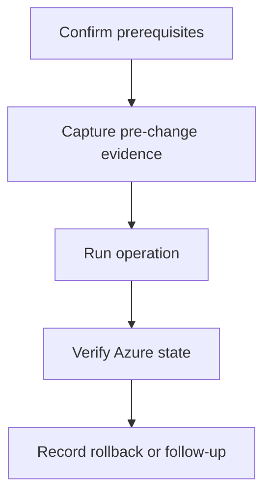

---
content_sources:
  diagrams:
  - id: operations-vmss-basics-runbook-flow
    type: flowchart
    source: mslearn-adapted
    description: Runbook flow
    based_on:
    - https://learn.microsoft.com/en-us/azure/virtual-machine-scale-sets/overview
    - https://learn.microsoft.com/en-us/azure/virtual-machine-scale-sets/virtual-machine-scale-sets-orchestration-modes
    - https://learn.microsoft.com/en-us/cli/azure/vmss
content_validation:
  status: pending_review
  last_reviewed: '2026-05-22'
  reviewer: ai-agent
  core_claims:
  - claim: This document has source metadata and is queued for text-level Microsoft
      Learn verification.
    source: https://learn.microsoft.com/en-us/azure/virtual-machine-scale-sets/overview
    verified: false
  - claim: Core Azure VM guidance on this page should remain traceable to the listed
      sources before it is marked verified.
    source: https://learn.microsoft.com/en-us/azure/virtual-machine-scale-sets/overview
    verified: false
---

# VMSS Basics

Use this runbook to inspect and operate Virtual Machine Scale Sets used for repeatable VM capacity.

## Prerequisites

- Azure CLI is installed and authenticated with the target subscription.
- Required variables are set before commands are run: `RG`, `VM_NAME`, and any resource-specific names in the command tables.
- The operator has permission to read and change the VM, disks, network interfaces, and monitoring resources involved in the procedure.
- A maintenance window and rollback owner are identified for production changes.

## When to Use

A stateless worker tier needs controlled scale-out with consistent images and health checks.

<!-- diagram-id: operations-vmss-basics-runbook-flow -->

```mermaid
flowchart TD
    A[Confirm prerequisites] --> B[Capture pre-change evidence]
    B --> C[Run operation]
    C --> D[Verify Azure state]
    D --> E[Record rollback or follow-up]
```

## Procedure

1. Confirm whether the scale set uses flexible or uniform orchestration mode.
2. Review instance count, upgrade policy, health model, and image version before scaling.
3. Scale in small steps and validate application health after each change.
4. Keep image and extension changes separate from capacity-only changes where possible.

### Command sequence

```bash
az vmss show \
    --resource-group $RG \
    --name $VMSS_NAME \
    --query "{name:name,sku:sku.name,capacity:sku.capacity,orchestration:orchestrationMode}" \
    --output json

az vmss scale \
    --resource-group $RG \
    --name $VMSS_NAME \
    --new-capacity 3 \
    --output json
```

| Element | Purpose |
|---|---|
| `$RG` | Resource group containing the VM resources. |
| `$VMSS_NAME` | Virtual Machine Scale Set name. |
| `--resource-group` | Scopes the command to the intended resource group. |
| `--name` | Identifies the resource being created, read, updated, or deleted. |
| `--query` | Filters the response so operators capture only the needed evidence. |
| `--output` | Controls the output format for logs, scripts, or human review. |
| `--new-capacity` | Azure CLI option used to scope or shape the operation. |
| Expected result | Command succeeds and returns the requested Azure resource state or operation result. |

## Verification

```bash
az vmss list-instances \
    --resource-group $RG \
    --name $VMSS_NAME \
    --query "[].{name:name,provisioningState:provisioningState}" \
    --output table
```

| Element | Purpose |
|---|---|
| `$RG` | Resource group containing the VM resources. |
| `$VMSS_NAME` | Virtual Machine Scale Set name. |
| `--resource-group` | Scopes the command to the intended resource group. |
| `--name` | Identifies the resource being created, read, updated, or deleted. |
| `--query` | Filters the response so operators capture only the needed evidence. |
| `--output` | Controls the output format for logs, scripts, or human review. |
| Expected result | Command succeeds and returns the requested Azure resource state or operation result. |

Confirm that the Azure output and guest/application checks match the intended post-change state.

## Rollback / Troubleshooting

- If the command fails, capture the error, Activity Log entry, and current resource state before retrying.
- If guest health is degraded after the change, revert to the documented previous size, disk setting, access rule, or restore point.
- Escalate when Azure reports regional capacity, unsupported SKU, policy denial, or backup/replication lock conflicts.

## See Also

- [Production Baseline](../best-practices/production-baseline.md)
- [Monitoring Best Practices](../best-practices/monitoring-best-practices.md)
- [Troubleshooting Playbooks](../troubleshooting/playbooks/index.md)

## Sources

- [Overview](https://learn.microsoft.com/en-us/azure/virtual-machine-scale-sets/overview)
- [Virtual Machine Scale Sets Orchestration Modes](https://learn.microsoft.com/en-us/azure/virtual-machine-scale-sets/virtual-machine-scale-sets-orchestration-modes)
- [Vmss](https://learn.microsoft.com/en-us/cli/azure/vmss)
