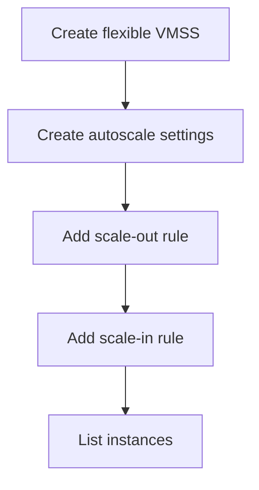

# VMSS Basics

This runbook creates a flexible orchestration VM scale set, sets a safe autoscale envelope, and verifies that instance inventory and scale rules are attached to the expected resource.

## Prerequisites

- Azure CLI installed and authenticated.
- A subnet already available for the scale set, or permission for `az vmss create` to create networking resources.
- A workload that benefits from multiple instances rather than a single manually managed VM.
- Agreement on minimum, default, and maximum instance counts.

## When to Use

- You need horizontal scale instead of resizing a single VM up again.
- You want Azure Monitor to add or remove instances based on sustained load.
- You are standardizing a stateless application tier on VMSS.

## Procedure

### Create the scale set and its autoscale rules

<!-- diagram-id: operations-vmss-basics-autoscale-architecture -->

```mermaid
flowchart TD
    A[Create flexible VMSS] --> B[Create autoscale settings]
    B --> C[Add scale-out rule]
    C --> D[Add scale-in rule]
    D --> E[List instances]
```

```bash
export RG="rg-vmss-app"
export LOCATION="eastus"
export VMSS_NAME="vmss-web"
export IMAGE="Ubuntu2204"
export ADMIN_USERNAME="azureuser"

az vmss create --resource-group "$RG" --name "$VMSS_NAME" --location "$LOCATION" --image "$IMAGE" --instance-count 2 --admin-username "$ADMIN_USERNAME" --generate-ssh-keys --orchestration-mode Flexible --vm-sku Standard_D2s_v5 --load-balancer "" --public-ip-address ""

az monitor autoscale create --resource-group "$RG" --name "$VMSS_NAME" --resource "$VMSS_NAME" --resource-type Microsoft.Compute/virtualMachineScaleSets --min-count 2 --max-count 6 --count 2

az monitor autoscale rule create --resource-group "$RG" --autoscale-name "$VMSS_NAME" --scale out 1 --condition "Percentage CPU > 75 avg 5m"

az monitor autoscale rule create --resource-group "$RG" --autoscale-name "$VMSS_NAME" --scale in 1 --condition "Percentage CPU < 25 avg 15m"

az vmss list-instances --resource-group "$RG" --name "$VMSS_NAME" --query "[].{id:instanceId,state:latestModelApplied,provisioning:provisioningState}" --output table
```
| Command | Purpose |
| --- | --- |
| `az vmss create` | Creates the flexible orchestration VM scale set. |
| `--resource-group` | Sets the scope for the scale set. |
| `--name` | Sets the scale set name. |
| `--location` | Chooses the deployment region. |
| `--image` | Selects the base OS image for instances. |
| `--instance-count` | Sets the starting instance count. |
| `--admin-username` | Sets the admin account for instances. |
| `--generate-ssh-keys` | Reuses or creates the SSH keys used for instance access. |
| `--orchestration-mode` | Chooses Flexible orchestration at creation time. |
| `--vm-sku` | Sets the VM size used for instances. |
| `--load-balancer` | Prevents automatic load balancer creation when you want to manage networking separately. |
| `--public-ip-address` | Prevents creation of public IP resources for each instance. |
| `az monitor autoscale create` | Creates the autoscale settings envelope for the VMSS. |
| `--resource` | Points autoscale at the VMSS resource. |
| `--resource-type` | Declares the resource type for autoscale. |
| `--min-count` | Sets the minimum instance floor. |
| `--max-count` | Sets the maximum instance ceiling. |
| `--count` | Sets the default instance count. |
| `az monitor autoscale rule create` | Adds scale rules to the autoscale settings. |
| `--autoscale-name` | Selects the autoscale settings object to update. |
| `--scale` | Defines whether to scale in or out and by how much. |
| `--condition` | Defines the metric threshold and evaluation period. |
| `az vmss list-instances` | Lists current VMSS instances after the scale set and rules exist. |
| `--query` | Returns the instance IDs and provisioning details you care about. |
| `--output` | Formats instance inventory as a table. |

The end state should be a flexible VMSS with two instances and autoscale configured to grow above 75 percent CPU and shrink below 25 percent CPU.

Example output:

```text
id   state   provisioning
---  ------  ------------
0    True    Succeeded
1    True    Succeeded
```

## Verification

Inspect the autoscale object to confirm the instance floor and ceiling were applied.

```bash
az monitor autoscale show --resource-group "$RG" --name "$VMSS_NAME" --query "profiles[0].capacity" --output yaml
```
| Command | Purpose |
| --- | --- |
| `az monitor autoscale show` | Reads the autoscale settings currently attached to the VMSS. |
| `--resource-group` | Selects the autoscale resource group. |
| `--name` | Selects the autoscale settings by name. |
| `--query` | Returns only the configured capacity bounds. |
| `--output` | Formats the autoscale capacity block as YAML. |

The result should show the expected minimum, default, and maximum counts. If those values are wrong, correct the autoscale profile before load arrives.

## Rollback / Troubleshooting

- If you picked the wrong orchestration mode, recreate the scale set; Azure does not let you change the mode after creation.
- If instance count never changes, check whether the workload actually emits enough CPU load to satisfy the autoscale rule window.
- If you need a stable fixed-size pool, keep the VMSS and remove the autoscale rules instead of deleting the whole scale set.
- If the application is stateful and does not tolerate scale-in, pause here and reassess whether VMSS is the right compute pattern.

## See Also

- [Operations](index.md)
- [Monitoring and Alerting](monitoring-and-alerting.md)
- [Compute Model](../platform/compute-model.md)

## Sources

- [Azure Virtual Machine Scale Sets overview](https://learn.microsoft.com/en-us/azure/virtual-machine-scale-sets/overview)
- [Orchestration modes for Virtual Machine Scale Sets in Azure](https://learn.microsoft.com/en-us/azure/virtual-machine-scale-sets/virtual-machine-scale-sets-orchestration-modes)
- [Overview of autoscale with Azure Virtual Machine Scale Sets](https://learn.microsoft.com/en-us/azure/virtual-machine-scale-sets/virtual-machine-scale-sets-autoscale-overview)
