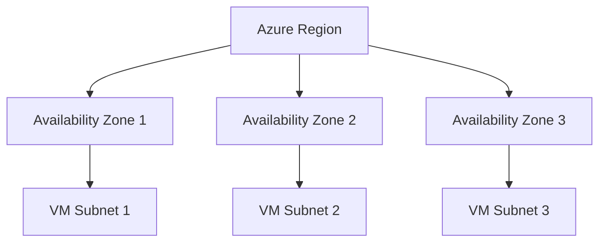

# Availability and Resiliency

To ensure high availability, Azure provides various tools and strategies to mitigate failures, ranging from hardware faults to entire datacenter outages.

## Availability Options

| Option | SLA | Protection Scope | Cost Impact |
| --- | --- | --- | --- |
| **Single VM** | 99.9% (Premium SSD) | Single rack/hardware failure. | Base cost |
| **Availability Sets** | 99.95% | Fault and update domain faults. | No extra cost |
| **Availability Zones** | 99.99% | Entire datacenter failure. | Potential data transfer cost |
| **VMSS** | Depends on config | Automatic scaling and high availability. | Scale-out costs |

## Availability Zone Architecture

Availability Zones are physically separate locations within each Azure region that provide redundancy.

!!! note
    **Fault Domains (FD)** protect against physical hardware failures, while **Update Domains (UD)** protect against scheduled maintenance.

!!! tip
    **Virtual Machine Scale Sets (VMSS)** allow you to create and manage a group of load-balanced VMs automatically.

## Sources
- [Azure VM availability options](https://learn.microsoft.com/en-us/azure/virtual-machines/availability)
- [Availability Sets overview](https://learn.microsoft.com/en-us/azure/virtual-machines/availability-set-overview)
- [Availability Zones overview](https://learn.microsoft.com/en-us/azure/reliability/availability-zones-overview)
