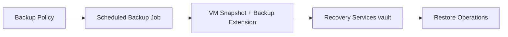

# Backup and Recovery Basics

Protecting your data from loss and corruption is crucial for enterprise workloads on Azure. Azure Backup and Site Recovery provide integrated disaster recovery and backup.

## Backup and DR Methods

| Method | Service SLA (Availability) | RPO/RTO Nature | Use Case |
| --- | --- | --- | --- |
| **Snapshots** | N/A | Point-in-time copy; restore time depends on workflow | Quick rollback before risky changes |
| **Azure Backup** | Backup service availability target (for service operation) | Depends on policy frequency and restore scope | Long-term retention and policy-driven protection |
| **ASR** | ASR service availability target | Replication-based RPO and failover-based RTO | Regional/datacenter disaster recovery |

## SLA vs RPO/RTO

| Concept | What it Means | What it Does **Not** Mean |
| --- | --- | --- |
| SLA | Azure service availability commitment (for example, Azure Backup service 99.9% availability) | A guarantee that your workload will always meet a specific RPO/RTO |
| RPO | Maximum acceptable data-loss window for your workload | A fixed value provided automatically by Azure without your design choices |
| RTO | Maximum acceptable recovery time for your workload | A fixed restore duration independent of data size and runbook readiness |

## Backup Architecture

Azure Backup for Azure VMs uses VM backup extensions with policy-driven scheduling into a Recovery Services vault.

!!! note
    **RPO (Recovery Point Objective)** is the maximum period of data loss, while **RTO (Recovery Time Objective)** is the time taken to restore services.

!!! tip
    Azure Backup SLA describes the **backup service availability**, not guaranteed workload recovery outcomes. Validate your expected RPO/RTO with regular restore testing.

!!! note
    A **Recovery Services vault** stores backup data and can be configured with locally-redundant (LRS), geo-redundant (GRS), or zone-redundant storage (ZRS), depending on scenario and region support.

## See Also

- [Backup and Restore Operations](../operations/backup-restore.md)
- [Backup Failures Troubleshooting](../troubleshooting/playbooks/boot-disk/backup-failures.md)

## Sources
- [Azure Backup overview](https://learn.microsoft.com/en-us/azure/backup/backup-overview)
- [Azure Site Recovery overview](https://learn.microsoft.com/en-us/azure/site-recovery/site-recovery-overview)
- [RPO and RTO definitions](https://learn.microsoft.com/en-us/azure/reliability/overview)
