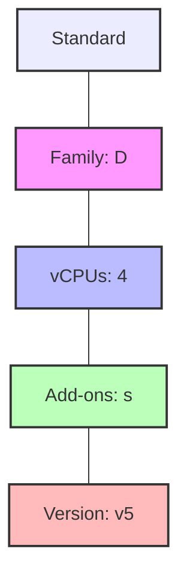

---
content_sources:
  diagrams:
  - id: platform-compute-model-naming-convention
    type: flowchart
    source: mslearn-adapted
    description: Naming Convention
    based_on:
    - https://learn.microsoft.com/en-us/azure/virtual-machines/sizes
    - https://learn.microsoft.com/en-us/azure/virtual-machines/sizes/overview
---

# Compute Model

Azure offers diverse VM sizes optimized for different workloads, from general-purpose computing to high-performance GPUs.

## VM Size Families

Azure categorizes VM sizes to help you select the best performance/cost ratio for your specific use case.

| Family | Series | Use Cases | Memory : vCPU Ratio |
| :--- | :--- | :--- | :--- |
| **General Purpose** | B, Dsv7/Dasv7, Dsv6/Dasv6, Dv5 | Testing, small/medium databases, web servers | Balanced |
| **Compute Optimized** | F, Fsv2 | Batch processing, analytics, gaming | High vCPU |
| **Memory Optimized** | Esv7/Easv7, Esv6/Easv6, Ev5, M | Relational databases, in-memory caches | High Memory |
| **Storage Optimized** | Lsv2, Lsv3 | NoSQL, Big Data, large data warehousing | High Disk I/O |
| **GPU** | N | Video editing, rendering, AI training | GPU/High Compute |

## Naming Convention

<!-- diagram-id: platform-compute-model-naming-convention -->

## Azure Compute Unit (ACU)

The ACU concept provides a way to compare compute (CPU) performance across different Azure VM families.

!!! note
    Standard_A1 is the baseline (ACU = 100). Higher ACUs indicate greater performance per vCPU.

## See Also

- [VM Size Families](../reference/vm-size-families.md)
- [VM Lifecycle](vm-lifecycle.md)
- [Sizing and Image Selection](../best-practices/sizing-and-image-selection.md)

## Sources
- [Sizes for virtual machines in Azure](https://learn.microsoft.com/en-us/azure/virtual-machines/sizes)
- [Azure Compute Unit (ACU)](https://learn.microsoft.com/en-us/azure/virtual-machines/sizes/overview)
