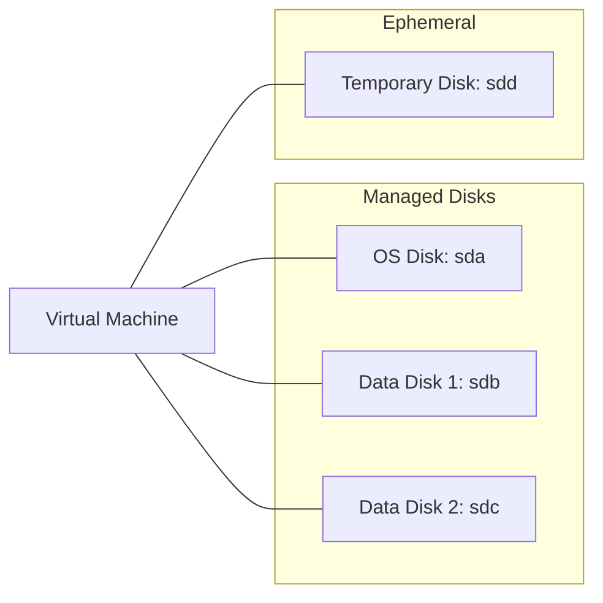

# Disks and Storage

Azure VM storage is provided through managed disks, offering persistent block storage with varying performance tiers.

## Disk Types

Azure VMs include several disk types for different storage requirements.

| Disk Type | Description | Persistence | Recommended Use |
| :--- | :--- | :--- | :--- |
| **OS Disk** | Contains the Operating System | Yes | Booting and system files |
| **Data Disk** | Attached for additional storage | Yes | Application data and logs |
| **Temporary Disk** | Ephemeral local storage | No | Page/Swap files and cache |

## Managed Disk Tiers

Managed disks provide different performance characteristics based on the storage tier selected.

| Tier | IOPS (Max) | Throughput (Max) | Latency | Cost |
| :--- | :--- | :--- | :--- | :--- |
| **Ultra Disk** | 160,000 | 4,000 MB/s | < 1ms | High |
| **Premium SSD v2** | 80,000 | 1,200 MB/s | < 1ms | Medium-High |
| **Standard SSD** | 6,000 | 750 MB/s | Single-digit ms | Medium |
| **Standard HDD** | 2,000 | 500 MB/s | ~10ms | Low |

## Disk Attachment Architecture

## Host Caching

!!! tip
    **ReadOnly** caching is ideal for read-heavy workloads (SQL Server data files). **ReadWrite** is best for write-heavy workloads but risk data loss on host failure.

## Sources
* [Azure managed disk types](https://learn.microsoft.com/en-us/azure/virtual-machines/disks-types)
* [Manage disk caching](https://learn.microsoft.com/en-us/azure/virtual-machines/disks-performance#disk-caching)
