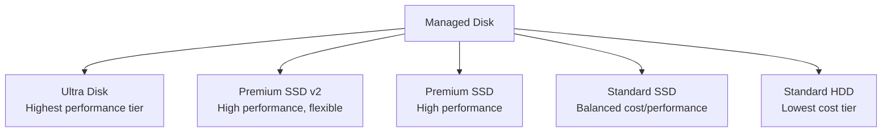

---
hide:
- toc
content_sources:
  diagrams:
  - id: platform-disks-and-storage-managed-disk-hierarchy
    type: flowchart
    source: mslearn-adapted
    description: Managed Disk Hierarchy
    based_on:
    - https://learn.microsoft.com/en-us/azure/virtual-machines/disks-types
    - https://learn.microsoft.com/en-us/azure/virtual-machines/disks-performance#disk-caching
---

# Disks and Storage

Azure VM storage uses managed disks with different latency, IOPS, and throughput characteristics. Correct disk type and caching choices are critical for both performance and durability.

## Disk Types

| Disk Type | Description | Persistence | Recommended Use |
| :--- | :--- | :--- | :--- |
| **OS Disk** | Contains operating system files | Yes | Boot and system state |
| **Data Disk** | Persistent application storage | Yes | Databases, app data, logs |
| **Temporary Disk** | Local host storage | No | Page/swap, temp, scratch data only |

## Managed Disk Tiers

| Tier | IOPS (Max) | Throughput (Max) | Typical Profile |
| :--- | :--- | :--- | :--- |
| **Ultra Disk** | Up to 400,000 | Up to 10,000 MB/s | Highest performance, low latency |
| **Premium SSD v2** | Up to 80,000 | Up to 1,200 MB/s | High performance, flexible provisioning |
| **Premium SSD** | Up to tier limit | Up to tier limit | Production transactional workloads |
| **Standard SSD/HDD** | Lower | Lower | Cost-optimized general workloads |

## Host Caching Guidance

!!! warning
    **Ultra Disk and Premium SSD v2 do not support host caching** (`ReadOnly` or `ReadWrite`). These disk types use their own performance architecture, so host caching settings are not applicable.

| Disk Role / Workload | Default Caching | Recommended Caching | Why |
| :--- | :--- | :--- | :--- |
| **OS Disk** | ReadWrite | ReadWrite (default) | Improves boot and OS read/write responsiveness |
| **Data Disk (general default)** | None | None (default) | Safe baseline for mixed and write-sensitive workloads |
| **Read-heavy data (reference/catalog/reporting)** | None | ReadOnly | Improves repeated reads |
| **Write-heavy data or DB transaction logs** | None | None | Avoids added write latency and crash-consistency risk |
| **Apps with explicit durable flush behavior** | None | ReadWrite (case-by-case) | Only when the app correctly handles flush/ordering |

## Managed Disk Hierarchy

<!-- diagram-id: platform-disks-and-storage-managed-disk-hierarchy -->

## See Also

- [Disk and Storage Best Practices](../best-practices/disk-and-storage-best-practices.md)
- [Disk Performance Troubleshooting](../troubleshooting/playbooks/performance/disk-performance-issues.md)

## Sources
- [Azure managed disk types](https://learn.microsoft.com/en-us/azure/virtual-machines/disks-types)
- [Manage disk caching](https://learn.microsoft.com/en-us/azure/virtual-machines/disks-performance#disk-caching)
