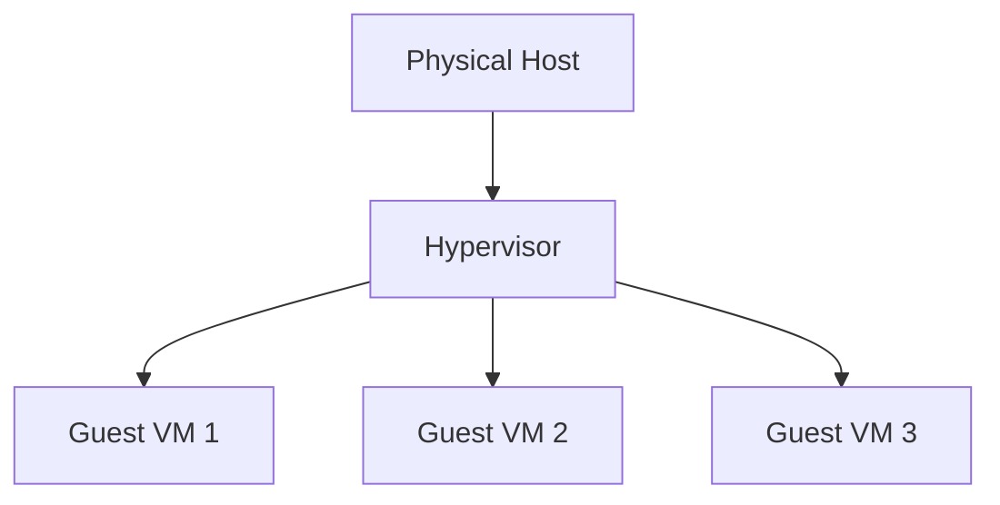

---
content_sources:
  diagrams:
  - id: platform-how-azure-vm-works-virtualization-architecture
    type: flowchart
    source: mslearn-adapted
    description: Virtualization Architecture
    based_on:
    - https://learn.microsoft.com/en-us/azure/virtual-machines/overview
    - https://learn.microsoft.com/en-us/azure/virtual-machines/availability
---

# How Azure VM Works

Azure Virtual Machines run on physical hardware managed by Microsoft, abstracted through a virtualization layer called a hypervisor.

## Management vs Data Plane

Azure separates administrative operations from actual workload traffic to ensure security and scalability.

| Plane | Purpose | Examples |
| :--- | :--- | :--- |
| **Management Plane** | Resource orchestration and API interactions | ARM templates, CLI commands, Portal actions |
| **Data Plane** | Actual workload traffic and application data | SSH/RDP traffic, SQL queries, Web requests |

## Virtualization Architecture

<!-- diagram-id: platform-how-azure-vm-works-virtualization-architecture -->

## Fault and Update Domains

When you place VMs in an Availability Set, Azure assigns each VM to a fault domain and update domain. Single VMs are not automatically distributed for high availability.

| Concept | Description | Failure Scope |
| :--- | :--- | :--- |
| **Fault Domain** | Shared power source and network switch | Physical hardware failure |
| **Update Domain** | Logical group for planned maintenance | Software updates/Reboots |

## See Also

- [Compute Model](compute-model.md)
- [VM Lifecycle](vm-lifecycle.md)
- [Availability Options](../reference/availability-options.md)

## Sources
- [Azure Virtual Machines Overview](https://learn.microsoft.com/en-us/azure/virtual-machines/overview)
- [Availability options for Azure Virtual Machines](https://learn.microsoft.com/en-us/azure/virtual-machines/availability)
