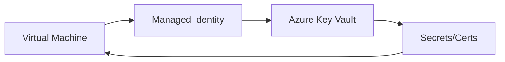

# Identity and Access

Azure Role-Based Access Control (RBAC) helps you manage who has access to Azure resources, what they can do with those resources, and what areas they have access to.

## RBAC Roles

| Role | Permissions | Scope |
| --- | --- | --- |
| **Owner** | Full access to all resources and management. | Subscription, Resource Group, Resource |
| **Contributor** | Can create/manage all resource types but not grant access. | Subscription, Resource Group, Resource |
| **VM Contributor** | Can manage VMs and their storage/networks. | Subscription, Resource Group, Resource |
| **Reader** | Can view existing resources but not modify. | Subscription, Resource Group, Resource |

## Managed Identity and Key Vault

Managed identities provide an identity for applications to use when connecting to resources that support Microsoft Entra authentication.

!!! tip
    Use **System-assigned managed identity** for single-resource identity and **User-assigned managed identity** when multiple resources need the same identity.

!!! warning
    Just-In-Time (JIT) VM access reduces exposure to brute force attacks by providing controlled access only when needed.

## Sources
- [Azure RBAC built-in roles](https://learn.microsoft.com/en-us/azure/role-based-access-control/built-in-roles)
- [What are managed identities?](https://learn.microsoft.com/en-us/entra/identity/managed-identities-azure-resources/overview)
- [JIT VM access](https://learn.microsoft.com/en-us/azure/defender-for-cloud/just-in-time-access-usage)
