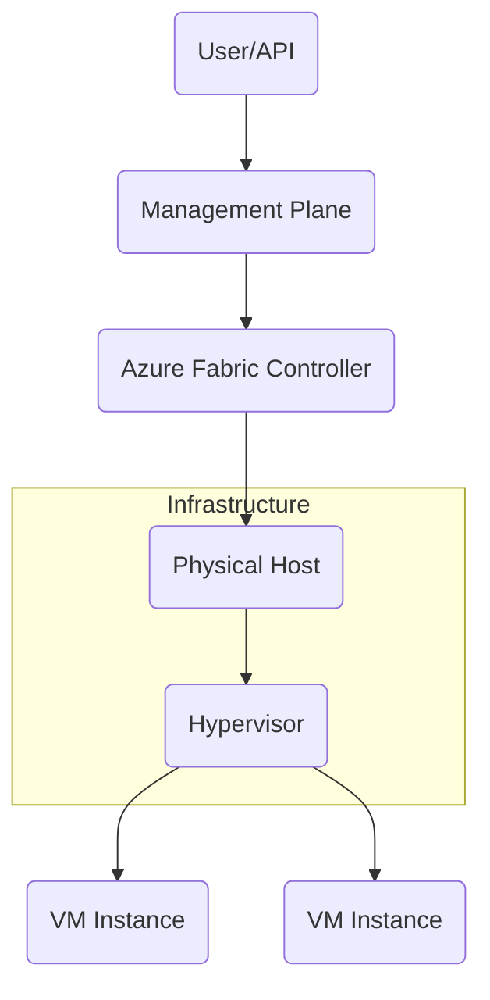

# Platform Fundamentals

This section explores the core operating principles of the Azure Virtual Machine platform. We focus on how the infrastructure behaves and the underlying components that power your virtualized workloads.

## Section Contents

| Page | Description |
|------|-------------|
| [How Azure VM Works](how-azure-vm-works.md) | Exploration of hosts, hypervisors, guest OS, and management/data planes. |
| [Compute Model](compute-model.md) | Understanding VM size families, vCPU/memory ratios, and burstable series. |
| [VM Lifecycle](vm-lifecycle.md) | Managing states: create, start, stop, deallocate, redeploy, and reimage. |
| [Disks and Storage](disks-and-storage.md) | Differentiating OS, data, and temp disks, plus managed disk caching. |
| [Networking Basics](networking-basics.md) | Core components: VNet, subnet, NIC, NSG, and Public IP addressing. |
| [Identity and Access](identity-and-access.md) | Securing workloads with RBAC, managed identities, and Key Vault integration. |
| [Availability and Resiliency](availability-and-resiliency.md) | Designing for uptime with Availability Sets, Zones, Scale Sets, and SLAs. |
| [Backup and Recovery Basics](backup-and-recovery-basics.md) | Introduction to Azure Backup, snapshots, and disaster recovery strategies. |

## Azure VM Architecture

!!! note
    Understanding the distinction between "Stop" and "Deallocate" is crucial for cost management and resource allocation within the Azure platform.

## Sources
- [Azure VM Architecture](https://learn.microsoft.com/en-us/azure/virtual-machines/overview)
- [Sizes for Virtual Machines](https://learn.microsoft.com/en-us/azure/virtual-machines/sizes/overview)
- [Managed Disks Overview](https://learn.microsoft.com/en-us/azure/virtual-machines/managed-disks-overview)
