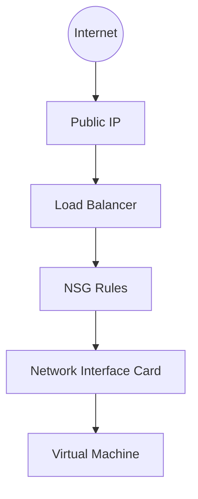

# Networking Basics

Azure Virtual Network (VNet) is the fundamental building block for your private network in Azure. It enables Azure resources to securely communicate with each other, the internet, and on-premises networks.

## Core Components

| Component | Purpose | Scope |
| --- | --- | --- |
| **VNet** | Provides logical isolation and private IP address space. | Region |
| **Subnet** | Segments VNet into smaller address ranges for management. | VNet |
| **NIC** | Connects a VM to a VNet to enable communication. | Subnet |
| **NSG** | Filters network traffic to and from Azure resources. | Subnet or NIC |
| **Public IP** | Provides internet connectivity to Azure resources. | Region |
| **Load Balancer** | Distributes incoming traffic across multiple VMs. | Region |
| **Azure Bastion** | Provides secure RDP/SSH access without public IPs. | VNet |

## Inbound Traffic Flow

Traffic originating from the internet passes through various layers before reaching the Virtual Machine interface.

!!! note
    Network Security Group (NSG) rules are processed by priority, where lower numbers have higher priority. Default rules exist to allow basic communication but can be overridden by custom rules.

## Sources
- [Azure Virtual Network concepts](https://learn.microsoft.com/en-us/azure/virtual-network/virtual-networks-overview)
- [NSG security rules](https://learn.microsoft.com/en-us/azure/virtual-network/network-security-groups-overview)
- [Azure Bastion overview](https://learn.microsoft.com/en-us/azure/bastion/bastion-overview)
