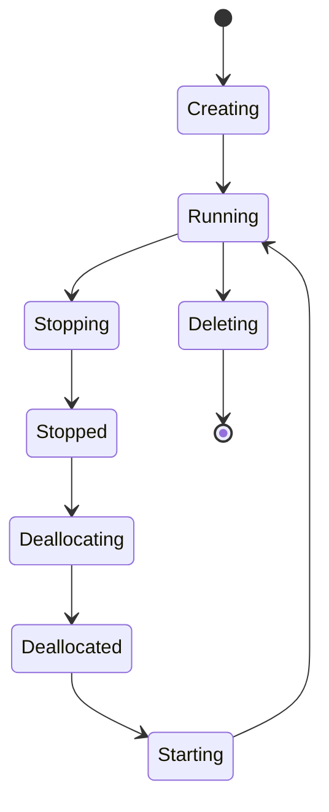

# VM Lifecycle

The VM lifecycle describes the various states an Azure VM can transition through, each with distinct billing and resource implications.

## Power States and Billing

Understanding the difference between "Stopped" and "Deallocated" is crucial for cost management.

| State | Billing (Compute) | IP Address Retention | Disk Retention |
| :--- | :--- | :--- | :--- |
| **Starting/Running** | Yes | Yes (Dynamic/Static) | Yes |
| **Stopped** | Yes | Yes (Dynamic/Static) | Yes |
| **Stopped (Deallocated)** | No | Dynamic IP released | Yes |
| **Deleting** | No | No | Depends (Delete with VM) |

## State Transitions

## Management Operations

Common maintenance and recovery operations for Azure Virtual Machines.

| Operation | Description | Use Case |
| :--- | :--- | :--- |
| **Redeploy** | Moves VM to a new host | Hardware-related failures |
| **Reimage** | Reinstalls the OS disk | Corrupted OS or configuration reset |
| **Restart** | Reboots the Guest OS | Software updates or configuration changes |

## Sources
* [Virtual machines lifecycle and states](https://learn.microsoft.com/en-us/azure/virtual-machines/states-lifecycle)
* [Redeploy virtual machines to new Azure node](https://learn.microsoft.com/en-us/azure/virtual-machines/redeploy-to-new-node)
