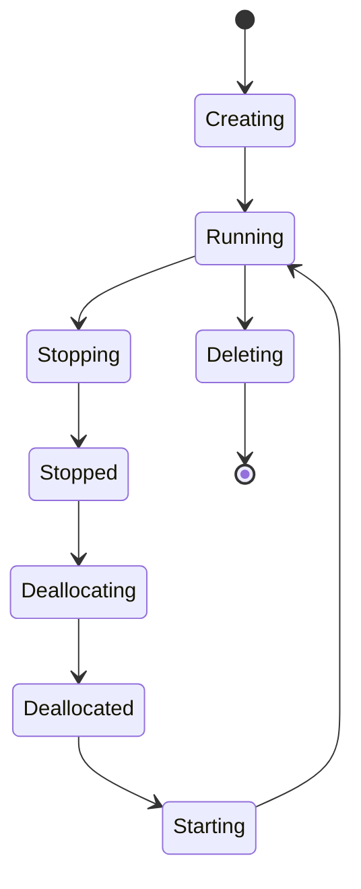

---
hide:
- toc
content_sources:
  diagrams:
  - id: platform-vm-lifecycle-state-transitions
    type: state
    source: mslearn-adapted
    description: State Transitions
    based_on:
    - https://learn.microsoft.com/en-us/azure/virtual-machines/states-billing
    - https://learn.microsoft.com/en-us/troubleshoot/azure/virtual-machines/windows/redeploy-to-new-node-windows
    - https://learn.microsoft.com/en-us/troubleshoot/azure/virtual-machines/linux/redeploy-to-new-node-linux
---

# VM Lifecycle

The VM lifecycle describes the various states an Azure VM can transition through, each with distinct billing and resource implications.

## Power States and Billing

Understanding the difference between "Stopped" and "Deallocated" is crucial for cost management.

| State | Billing (Compute) | IP Address Retention | Disk Retention |
| :--- | :--- | :--- | :--- |
| **Starting/Running** | Yes | Yes (Dynamic/Static) | Yes |
| **Stopped** | Yes | Yes (Dynamic/Static) | Yes |
| **Stopped (Deallocated)** | No | Private IP retained; dynamic public IP released; static public IP retained | Yes |
| **Deleting** | No | No | Depends (Delete with VM) |

## State Transitions

<!-- diagram-id: platform-vm-lifecycle-state-transitions -->

## Management Operations

Common maintenance and recovery operations for Azure Virtual Machines.

| Operation | Description | Use Case |
| :--- | :--- | :--- |
| **Redeploy** | Moves VM to a new host | Hardware-related failures |
| **Reimage** | Reinstalls the OS disk | Corrupted OS or configuration reset |
| **Restart** | Reboots the Guest OS | Software updates or configuration changes |

## See Also

- [How Azure VM Works](how-azure-vm-works.md)
- [Resize and Redeploy](../operations/resize-and-redeploy.md)
- [Cost Optimization Best Practices](../best-practices/cost-optimization-best-practices.md)

## Sources
- [Virtual machines lifecycle and states](https://learn.microsoft.com/en-us/azure/virtual-machines/states-billing)
- [Redeploy Windows virtual machine to new Azure node](https://learn.microsoft.com/en-us/troubleshoot/azure/virtual-machines/windows/redeploy-to-new-node-windows)
- [Redeploy Linux virtual machine to new Azure node](https://learn.microsoft.com/en-us/troubleshoot/azure/virtual-machines/linux/redeploy-to-new-node-linux)
