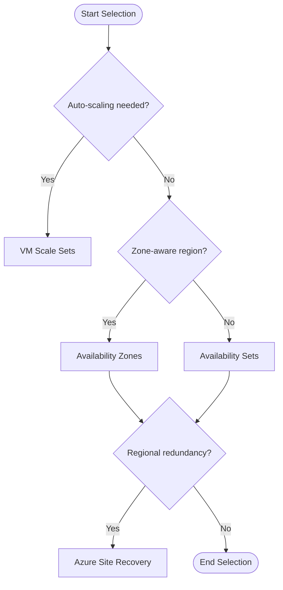

# Availability Options

Azure provides several options to protect your virtual machines from hardware failures, network outages, and data center disasters. Use these mechanisms to meet your application's Service Level Agreement (SLA) requirements.

| Option | SLA | Scope | Protection Against | Cost Impact | When to Use |
| :--- | :--- | :--- | :--- | :--- | :--- |
| **Single VM (Premium SSD)** | 99.9% | Instance | Hardware failure | Base | Dev/Test, low criticality |
| **Availability Set** | 99.95% | Rack | Hardware/Update failures | Low | Legacy apps, no zone support |
| **Availability Zone** | 99.99% | Data Center | Data center failure | Medium | High availability, primary production |
| **VMSS (Uniform)** | 99.95% - 99.99% | Multi-Zone | Large-scale failures | Variable | Auto-scaling workloads |
| **Cross-Region (ASR)** | Variable | Region | Regional disaster | High | Disaster recovery, business continuity |

!!! warning
    Availability Sets only protect against failures within a single data center. For protection against data center outages, you must use Availability Zones.

## Sources
- [Availability options for Azure Virtual Machines](https://learn.microsoft.com/en-us/azure/virtual-machines/availability)
- [Availability sets overview](https://learn.microsoft.com/en-us/azure/virtual-machines/availability-set-overview)
- [Availability zones overview](https://learn.microsoft.com/en-us/azure/availability-zones/az-overview)
- [Virtual Machine Scale Sets overview](https://learn.microsoft.com/en-us/azure/virtual-machine-scale-sets/overview)
- [Azure Site Recovery documentation](https://learn.microsoft.com/en-us/azure/site-recovery/site-recovery-overview)
