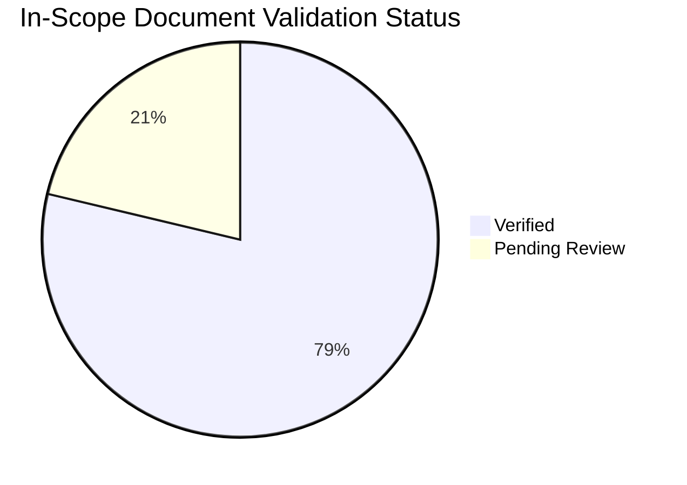

# Content Validation Status

This page tracks `content_validation` metadata for **in-scope factual-claim documents** under `docs/best-practices/`, `docs/operations/`, `docs/platform/`, `docs/troubleshooting/`. Pages outside this scope — tutorials, start-here, reference, contributing, excluded subpaths (none), and navigation indexes (`docs/best-practices/index.md`, `docs/operations/index.md`, `docs/platform/index.md`, `docs/troubleshooting/first-10-minutes/index.md`, `docs/troubleshooting/index.md`, `docs/troubleshooting/playbooks/index.md`) — are not counted here. See `scripts/lib/content_scope.py` for the executable scope definition.

## Summary

*Generated: 2026-07-25*

| Metric | Count |
|---|---:|
| In-scope factual-claim documents | 47 |
| ✅ Verified | 37 |
| ⚠️ Pending review | 10 |
| ➖ Unverified | 0 |
| ❓ No metadata | 0 |

<!-- diagram-id: content-validation-status-pie -->


## By Section

### Platform

| Document | Has Sources | Status | Claims | Last Reviewed |
|---|---|---|---|---|
| [Availability And Resiliency](../platform/availability-and-resiliency.md) | ✅ | ✅ Verified | 2/2 | 2026-07-25 |
| [Backup And Recovery Basics](../platform/backup-and-recovery-basics.md) | ✅ | ✅ Verified | 2/2 | 2026-07-25 |
| [Compute Model](../platform/compute-model.md) | ✅ | ✅ Verified | 2/2 | 2026-07-25 |
| [Disks And Storage](../platform/disks-and-storage.md) | ✅ | ✅ Verified | 2/2 | 2026-07-25 |
| [How Azure Vm Works](../platform/how-azure-vm-works.md) | ✅ | ✅ Verified | 2/2 | 2026-07-25 |
| [Identity And Access](../platform/identity-and-access.md) | ✅ | ✅ Verified | 2/2 | 2026-07-25 |
| [Networking Basics](../platform/networking-basics.md) | ✅ | ✅ Verified | 3/3 | 2026-07-25 |
| [Vm Lifecycle](../platform/vm-lifecycle.md) | ✅ | ✅ Verified | 2/2 | 2026-07-25 |

### Best Practices

| Document | Has Sources | Status | Claims | Last Reviewed |
|---|---|---|---|---|
| [Backup And Dr Best Practices](../best-practices/backup-and-dr-best-practices.md) | ✅ | ⚠️ Pending Review | 3/3 | 2026-07-25 |
| [Common Anti Patterns](../best-practices/common-anti-patterns.md) | ✅ | ⚠️ Pending Review | 3/3 | 2026-07-25 |
| [Cost Optimization Best Practices](../best-practices/cost-optimization-best-practices.md) | ✅ | ⚠️ Pending Review | 3/3 | 2026-07-25 |
| [Disk And Storage Best Practices](../best-practices/disk-and-storage-best-practices.md) | ✅ | ⚠️ Pending Review | 3/3 | 2026-07-25 |
| [Monitoring Best Practices](../best-practices/monitoring-best-practices.md) | ✅ | ⚠️ Pending Review | 3/3 | 2026-07-25 |
| [Networking Best Practices](../best-practices/networking-best-practices.md) | ✅ | ⚠️ Pending Review | 3/3 | 2026-07-25 |
| [Patching And Maintenance Best Practices](../best-practices/patching-and-maintenance-best-practices.md) | ✅ | ⚠️ Pending Review | 3/3 | 2026-07-25 |
| [Production Baseline](../best-practices/production-baseline.md) | ✅ | ⚠️ Pending Review | 3/3 | 2026-07-25 |
| [Security Best Practices](../best-practices/security-best-practices.md) | ✅ | ⚠️ Pending Review | 3/3 | 2026-07-25 |
| [Sizing And Image Selection](../best-practices/sizing-and-image-selection.md) | ✅ | ⚠️ Pending Review | 3/3 | 2026-07-25 |

### Operations

| Document | Has Sources | Status | Claims | Last Reviewed |
|---|---|---|---|---|
| [Backup Restore](../operations/backup-restore.md) | ✅ | ✅ Verified | 2/2 | 2026-07-25 |
| [Connect To Vm](../operations/connect-to-vm.md) | ✅ | ✅ Verified | 2/2 | 2026-07-25 |
| [Create And Configure Vm](../operations/create-and-configure-vm.md) | ✅ | ✅ Verified | 2/2 | 2026-07-25 |
| [Manage Disks](../operations/manage-disks.md) | ✅ | ✅ Verified | 2/2 | 2026-07-25 |
| [Monitoring And Alerting](../operations/monitoring-and-alerting.md) | ✅ | ✅ Verified | 2/2 | 2026-07-25 |
| [Patching](../operations/patching.md) | ✅ | ✅ Verified | 2/2 | 2026-07-25 |
| [Resize And Redeploy](../operations/resize-and-redeploy.md) | ✅ | ✅ Verified | 2/2 | 2026-07-25 |
| [Snapshots And Images](../operations/snapshots-and-images.md) | ✅ | ✅ Verified | 2/2 | 2026-07-25 |
| [Vmss Basics](../operations/vmss-basics.md) | ✅ | ✅ Verified | 3/3 | 2026-07-25 |

### Troubleshooting

| Document | Has Sources | Status | Claims | Last Reviewed |
|---|---|---|---|---|
| [Architecture Overview](../troubleshooting/architecture-overview.md) | ✅ | ✅ Verified | 2/2 | 2026-07-25 |
| [Decision Tree](../troubleshooting/decision-tree.md) | ✅ | ✅ Verified | 2/2 | 2026-07-25 |
| [Evidence Map](../troubleshooting/evidence-map.md) | ✅ | ✅ Verified | 3/3 | 2026-07-25 |
| [Boot](../troubleshooting/first-10-minutes/boot.md) | ✅ | ✅ Verified | 2/2 | 2026-07-25 |
| [Connectivity](../troubleshooting/first-10-minutes/connectivity.md) | ✅ | ✅ Verified | 2/2 | 2026-07-25 |
| [Performance](../troubleshooting/first-10-minutes/performance.md) | ✅ | ✅ Verified | 2/2 | 2026-07-25 |
| [Mental Model](../troubleshooting/mental-model.md) | ✅ | ✅ Verified | 2/2 | 2026-07-25 |
| [Backup Failures](../troubleshooting/playbooks/boot-disk/backup-failures.md) | ✅ | ✅ Verified | 2/2 | 2026-07-25 |
| [Boot Diagnostics And Serial Console](../troubleshooting/playbooks/boot-disk/boot-diagnostics-and-serial-console.md) | ✅ | ✅ Verified | 2/2 | 2026-07-25 |
| [Vm Wont Start](../troubleshooting/playbooks/boot-disk/vm-wont-start.md) | ✅ | ✅ Verified | 2/2 | 2026-07-25 |
| [Cannot Rdp Or Ssh](../troubleshooting/playbooks/connectivity/cannot-rdp-or-ssh.md) | ✅ | ✅ Verified | 2/2 | 2026-07-25 |
| [Dns And Connectivity Issues](../troubleshooting/playbooks/connectivity/dns-and-connectivity-issues.md) | ✅ | ✅ Verified | 2/2 | 2026-07-25 |
| [Extension Failures](../troubleshooting/playbooks/connectivity/extension-failures.md) | ✅ | ✅ Verified | 2/2 | 2026-07-25 |
| [Network Connectivity Issues](../troubleshooting/playbooks/network-connectivity-issues.md) | ✅ | ✅ Verified | 2/2 | 2026-07-25 |
| [Disk Performance Issues](../troubleshooting/playbooks/performance/disk-performance-issues.md) | ✅ | ✅ Verified | 2/2 | 2026-07-25 |
| [High Cpu Memory Disk](../troubleshooting/playbooks/performance/high-cpu-memory-disk.md) | ✅ | ✅ Verified | 2/2 | 2026-07-25 |
| [Slow Performance](../troubleshooting/playbooks/performance/slow-performance.md) | ✅ | ✅ Verified | 2/2 | 2026-07-25 |
| [Rdp Ssh Connection Failures](../troubleshooting/playbooks/rdp-ssh-connection-failures.md) | ✅ | ✅ Verified | 2/2 | 2026-07-25 |
| [Vm Boot Failures](../troubleshooting/playbooks/vm-boot-failures.md) | ✅ | ✅ Verified | 2/2 | 2026-07-25 |
| [Quick Diagnosis Cards](../troubleshooting/quick-diagnosis-cards.md) | ✅ | ✅ Verified | 2/2 | 2026-07-25 |

## Validation Status

| Status | Description |
|---|---|
| `verified` | All listed core claims were checked against Microsoft Learn sources. |
| `pending_review` | The page has metadata, but one or more claims still need verification. |
| `unverified` | The page carries metadata, but no claims have been verified yet. |

## How to Add Validation

Add a `content_validation` block only to in-scope factual-claim pages.

```yaml
---
content_validation:
  status: verified
  last_reviewed: 2026-07-25
  reviewer: agent
  core_claims:
    - claim: "Azure Virtual Machines supports multiple size families optimized for different workload classes."
      source: https://learn.microsoft.com/en-us/azure/virtual-machines/sizes
      verified: true
```

Claims containing the marker `primary source basis` are rejected because they are metadata about the page rather than factual Azure behavior.

## See Also

- [Tutorial Validation Status](validation-status.md)
- [VM Size Families](vm-size-families.md)
- [Availability Options](availability-options.md)

