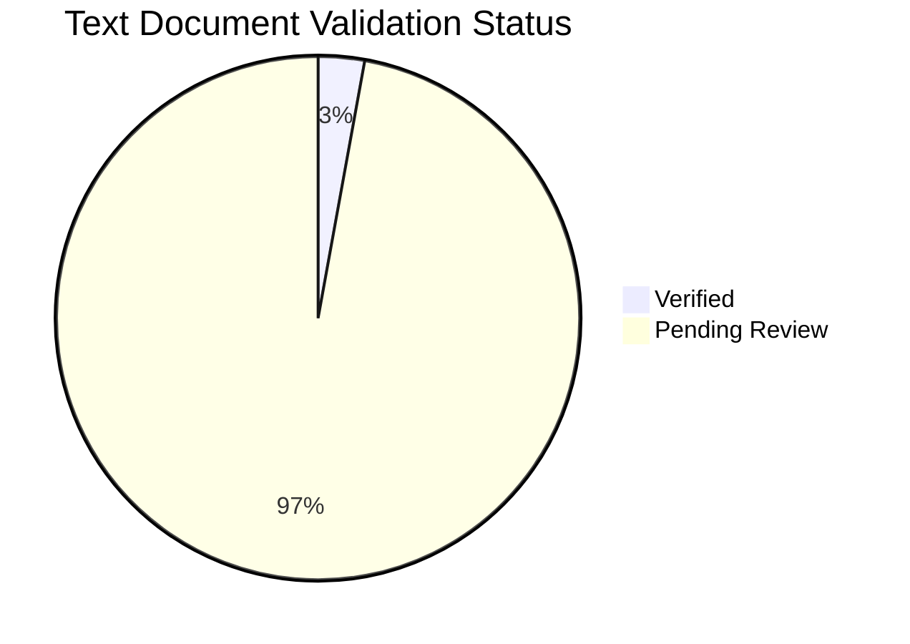

---
content_sources:
  diagrams:
  - id: content-validation-status-pie
    type: pie
    source: self-generated
    justification: Auto-generated dashboard from repository frontmatter.
  sources:
  - type: mslearn-adapted
    url: https://learn.microsoft.com/en-us/azure/virtual-machines/overview
content_validation:
  status: verified
  last_reviewed: '2026-05-23'
  reviewer: ai-agent
  core_claims:
  - claim: This dashboard is generated from content_validation frontmatter in this
      repository.
    source: scripts/generate_content_validation_status.py
    verified: true
  - claim: The repository content policy requires Microsoft Learn traceability for
      core Azure VM guidance.
    source: AGENTS.md
    verified: true
---
# Content Validation Status

This page is generated from `content_validation` frontmatter across non-tutorial documentation. It distinguishes verified pages from pages that have metadata but still need text-level source review.

## Summary

*Generated: 2026-05-23*

| Content Type | Total | Verified | Pending | Unverified | No Metadata |
|---|---:|---:|---:|---:|---:|
| Mermaid Diagrams | 81 | 81 | 0 | 0 | 0 |
| Text Documents | 70 | 2 | 68 | 0 | 0 |

<!-- diagram-id: content-validation-status-pie -->


## By Section

### Root

| Document | Sources | Status | Claims | Last Reviewed |
|---|---|---|---:|---|
| [Index](../index.md) | yes | Pending Review | 0/2 | 2026-05-22 |

### Start Here

| Document | Sources | Status | Claims | Last Reviewed |
|---|---|---|---:|---|
| [Common Scenarios](../start-here/common-scenarios.md) | yes | Pending Review | 0/2 | 2026-05-22 |
| [Index](../start-here/index.md) | yes | Pending Review | 0/2 | 2026-05-22 |
| [Learning Path](../start-here/learning-path.md) | yes | Pending Review | 0/2 | 2026-05-22 |
| [Overview](../start-here/overview.md) | yes | Pending Review | 0/2 | 2026-05-22 |
| [Vm Vs Other Compute](../start-here/vm-vs-other-compute.md) | yes | Pending Review | 0/2 | 2026-05-22 |

### Platform

| Document | Sources | Status | Claims | Last Reviewed |
|---|---|---|---:|---|
| [Availability And Resiliency](../platform/availability-and-resiliency.md) | yes | Pending Review | 0/2 | 2026-05-22 |
| [Backup And Recovery Basics](../platform/backup-and-recovery-basics.md) | yes | Pending Review | 0/2 | 2026-05-22 |
| [Compute Model](../platform/compute-model.md) | yes | Pending Review | 0/2 | 2026-05-22 |
| [Disks And Storage](../platform/disks-and-storage.md) | yes | Pending Review | 0/2 | 2026-05-22 |
| [How Azure Vm Works](../platform/how-azure-vm-works.md) | yes | Pending Review | 0/2 | 2026-05-22 |
| [Identity And Access](../platform/identity-and-access.md) | yes | Pending Review | 0/2 | 2026-05-22 |
| [Index](../platform/index.md) | yes | Pending Review | 0/2 | 2026-05-22 |
| [Networking Basics](../platform/networking-basics.md) | yes | Pending Review | 0/2 | 2026-05-22 |
| [Vm Lifecycle](../platform/vm-lifecycle.md) | yes | Pending Review | 0/2 | 2026-05-22 |

### Best Practices

| Document | Sources | Status | Claims | Last Reviewed |
|---|---|---|---:|---|
| [Backup And Dr Best Practices](../best-practices/backup-and-dr-best-practices.md) | yes | Pending Review | 0/2 | 2026-05-22 |
| [Common Anti Patterns](../best-practices/common-anti-patterns.md) | yes | Pending Review | 0/2 | 2026-05-22 |
| [Cost Optimization Best Practices](../best-practices/cost-optimization-best-practices.md) | yes | Pending Review | 0/2 | 2026-05-22 |
| [Disk And Storage Best Practices](../best-practices/disk-and-storage-best-practices.md) | yes | Pending Review | 0/2 | 2026-05-22 |
| [Index](../best-practices/index.md) | yes | Pending Review | 0/2 | 2026-05-22 |
| [Monitoring Best Practices](../best-practices/monitoring-best-practices.md) | yes | Pending Review | 0/2 | 2026-05-22 |
| [Networking Best Practices](../best-practices/networking-best-practices.md) | yes | Pending Review | 0/2 | 2026-05-22 |
| [Patching And Maintenance Best Practices](../best-practices/patching-and-maintenance-best-practices.md) | yes | Pending Review | 0/2 | 2026-05-22 |
| [Production Baseline](../best-practices/production-baseline.md) | yes | Pending Review | 0/2 | 2026-05-22 |
| [Security Best Practices](../best-practices/security-best-practices.md) | yes | Pending Review | 0/2 | 2026-05-22 |
| [Sizing And Image Selection](../best-practices/sizing-and-image-selection.md) | yes | Pending Review | 0/2 | 2026-05-22 |

### Operations

| Document | Sources | Status | Claims | Last Reviewed |
|---|---|---|---:|---|
| [Backup Restore](../operations/backup-restore.md) | yes | Pending Review | 0/2 | 2026-05-22 |
| [Connect To Vm](../operations/connect-to-vm.md) | yes | Pending Review | 0/2 | 2026-05-22 |
| [Create And Configure Vm](../operations/create-and-configure-vm.md) | yes | Pending Review | 0/2 | 2026-05-22 |
| [Index](../operations/index.md) | yes | Pending Review | 0/2 | 2026-05-22 |
| [Manage Disks](../operations/manage-disks.md) | yes | Pending Review | 0/2 | 2026-05-22 |
| [Monitoring And Alerting](../operations/monitoring-and-alerting.md) | yes | Pending Review | 0/2 | 2026-05-22 |
| [Patching](../operations/patching.md) | yes | Pending Review | 0/2 | 2026-05-22 |
| [Resize And Redeploy](../operations/resize-and-redeploy.md) | yes | Pending Review | 0/2 | 2026-05-22 |
| [Snapshots And Images](../operations/snapshots-and-images.md) | yes | Pending Review | 0/2 | 2026-05-22 |
| [Vmss Basics](../operations/vmss-basics.md) | yes | Pending Review | 0/2 | 2026-05-22 |

### Troubleshooting

| Document | Sources | Status | Claims | Last Reviewed |
|---|---|---|---:|---|
| [Architecture Overview](../troubleshooting/architecture-overview.md) | yes | Pending Review | 0/2 | 2026-05-22 |
| [Decision Tree](../troubleshooting/decision-tree.md) | yes | Pending Review | 0/2 | 2026-05-22 |
| [Evidence Map](../troubleshooting/evidence-map.md) | yes | Pending Review | 0/2 | 2026-05-22 |
| [Boot](../troubleshooting/first-10-minutes/boot.md) | yes | Pending Review | 0/2 | 2026-05-22 |
| [Connectivity](../troubleshooting/first-10-minutes/connectivity.md) | yes | Pending Review | 0/2 | 2026-05-22 |
| [Index](../troubleshooting/first-10-minutes/index.md) | yes | Pending Review | 0/2 | 2026-05-22 |
| [Performance](../troubleshooting/first-10-minutes/performance.md) | yes | Pending Review | 0/2 | 2026-05-22 |
| [Index](../troubleshooting/index.md) | yes | Pending Review | 0/2 | 2026-05-22 |
| [Mental Model](../troubleshooting/mental-model.md) | yes | Pending Review | 0/2 | 2026-05-22 |
| [Backup Failures](../troubleshooting/playbooks/boot-disk/backup-failures.md) | yes | Pending Review | 0/2 | 2026-05-22 |
| [Boot Diagnostics And Serial Console](../troubleshooting/playbooks/boot-disk/boot-diagnostics-and-serial-console.md) | yes | Pending Review | 0/2 | 2026-05-22 |
| [Vm Wont Start](../troubleshooting/playbooks/boot-disk/vm-wont-start.md) | yes | Pending Review | 0/2 | 2026-05-22 |
| [Cannot Rdp Or Ssh](../troubleshooting/playbooks/connectivity/cannot-rdp-or-ssh.md) | yes | Pending Review | 0/2 | 2026-05-22 |
| [Dns And Connectivity Issues](../troubleshooting/playbooks/connectivity/dns-and-connectivity-issues.md) | yes | Pending Review | 0/2 | 2026-05-22 |
| [Extension Failures](../troubleshooting/playbooks/connectivity/extension-failures.md) | yes | Pending Review | 0/2 | 2026-05-22 |
| [Disk Performance Issues](../troubleshooting/playbooks/disk-performance-issues.md) | yes | Pending Review | 0/2 | 2026-05-22 |
| [Index](../troubleshooting/playbooks/index.md) | yes | Pending Review | 0/2 | 2026-05-22 |
| [Network Connectivity Issues](../troubleshooting/playbooks/network-connectivity-issues.md) | yes | Pending Review | 0/2 | 2026-05-22 |
| [Disk Performance Issues](../troubleshooting/playbooks/performance/disk-performance-issues.md) | yes | Pending Review | 0/2 | 2026-05-22 |
| [High Cpu Memory Disk](../troubleshooting/playbooks/performance/high-cpu-memory-disk.md) | yes | Pending Review | 0/2 | 2026-05-22 |
| [Slow Performance](../troubleshooting/playbooks/performance/slow-performance.md) | yes | Pending Review | 0/2 | 2026-05-22 |
| [Rdp Ssh Connection Failures](../troubleshooting/playbooks/rdp-ssh-connection-failures.md) | yes | Pending Review | 0/2 | 2026-05-22 |
| [Vm Boot Failures](../troubleshooting/playbooks/vm-boot-failures.md) | yes | Pending Review | 0/2 | 2026-05-22 |
| [Quick Diagnosis Cards](../troubleshooting/quick-diagnosis-cards.md) | yes | Pending Review | 0/2 | 2026-05-22 |

### Reference

| Document | Sources | Status | Claims | Last Reviewed |
|---|---|---|---:|---|
| [Availability Options](../reference/availability-options.md) | yes | Pending Review | 0/2 | 2026-05-22 |
| [Content Validation Status](../reference/content-validation-status.md) | yes | Verified | 2/2 | 2026-05-22 |
| [Glossary](../reference/glossary.md) | yes | Pending Review | 0/2 | 2026-05-22 |
| [Index](../reference/index.md) | yes | Pending Review | 0/2 | 2026-05-22 |
| [Managed Disk Types](../reference/managed-disk-types.md) | yes | Pending Review | 0/2 | 2026-05-22 |
| [Monitoring Signals](../reference/monitoring-signals.md) | yes | Pending Review | 0/2 | 2026-05-22 |
| [Networking Components](../reference/networking-components.md) | yes | Pending Review | 0/3 | 2026-05-22 |
| [Validation Status](../reference/validation-status.md) | yes | Verified | 2/2 | 2026-05-22 |
| [Vm Size Families](../reference/vm-size-families.md) | yes | Pending Review | 0/2 | 2026-05-22 |

### Contributing

| Document | Sources | Status | Claims | Last Reviewed |
|---|---|---|---:|---|
| [Index](../contributing/index.md) | no | Pending Review | 0/2 | 2026-05-22 |

## How to Update

Add or update `content_validation` in a document's YAML frontmatter, then regenerate this page:

```bash
python3 scripts/generate_content_validation_status.py
```

| Field | Meaning |
|---|---|
| `status` | `verified`, `pending_review`, or `unverified` |
| `last_reviewed` | Date when the claims were last checked |
| `core_claims` | The factual claims tracked for source validation |

## See Also

- [Validation Status](validation-status.md)
- [VM Size Families](vm-size-families.md)
- [Networking Components](networking-components.md)

## Sources

- [Microsoft Learn overview](https://learn.microsoft.com/en-us/azure/virtual-machines/overview)
