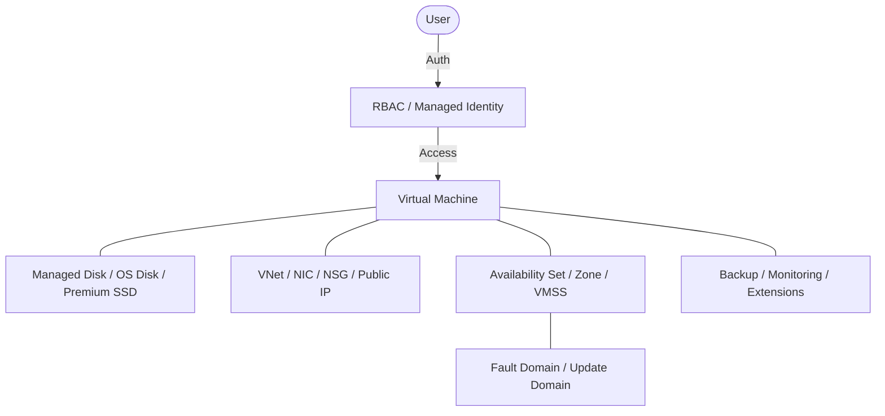

---
hide:
- toc
content_sources:
  diagrams:
  - id: reference-glossary-glossary
    type: flowchart
    source: mslearn-adapted
    description: Glossary
    based_on:
    - https://learn.microsoft.com/en-us/azure/virtual-machines/
    - https://learn.microsoft.com/en-us/azure/virtual-machines/managed-disks-overview
    - https://learn.microsoft.com/en-us/azure/virtual-network/virtual-networks-overview
    - https://learn.microsoft.com/en-us/azure/backup/backup-overview
    - https://learn.microsoft.com/en-us/azure/role-based-access-control/overview
---

# Glossary

This glossary provides a quick reference for common Azure Virtual Machine terms and concepts. Refer to these definitions to better understand the Azure compute platform.

| Term | Definition | Related Concept |
| :--- | :--- | :--- |
| **ACU** | Azure Compute Unit; a way of comparing CPU performance across VM sizes. | VM Size |
| **Availability Set** | A logical grouping of VMs that ensures they are spread across different hardware racks. | Fault Domain |
| **Availability Zone** | Physically separate data centers within an Azure region. | SLA |
| **Azure Bastion** | A service providing secure RDP and SSH access to VMs over SSL. | NSG |
| **Azure Backup** | A service to back up and restore data from Azure VMs. | Recovery Services vault |
| **Boot Diagnostics** | A feature that captures the console output and screenshots of a VM during startup. | Troubleshooting |
| **Custom Script Extension** | A tool to download and run scripts on Azure VMs for post-deployment configuration. | VM Extension |
| **Deallocate** | Stopping a VM and releasing its hardware resources to avoid compute charges. | Stopped |
| **Temporary Disk** | A local disk on the host server providing short-term storage; data is lost on stop/deallocate or host maintenance. Not a managed disk. | Ephemeral OS Disk |
| **Fault Domain** | A group of VMs that share a common power source and network switch. | Availability Set |
| **JIT Access** | Just-In-Time access; minimizes exposure to attacks by only opening ports when needed. | Defender for Cloud |
| **Managed Disk** | A disk managed by Azure, simplifying storage account management. | Storage Account |
| **Managed Identity** | An identity for Azure resources that allows them to authenticate to other services. | Entra ID |
| **NSG** | Network Security Group; filters network traffic to and from Azure resources. | Firewall |
| **NIC** | Network Interface Card; enables a VM to communicate with other resources. | VNet |
| **OS Disk** | The disk containing the operating system for the VM. | Managed Disk |
| **Premium SSD** | High-performance SSD-based storage for I/O-intensive workloads. | Managed Disk |
| **Public IP** | An IP address used for communication with resources outside the VNet. | Internet |
| **RBAC** | Role-Based Access Control; manages access to Azure resources based on roles. | IAM |
| **Recovery Services vault** | A storage entity in Azure that holds data like backup copies and recovery points. | Azure Backup |
| **Redeploy** | Moving a VM to a new Azure node to resolve hardware-related issues. | Troubleshooting |
| **Reimage** | Reinstalling the operating system on a VM disk. | OS Disk |
| **Serial Console** | A tool providing direct console access to a VM for troubleshooting boot issues. | Boot Diagnostics |
| **VMSS** | Virtual Machine Scale Sets; allow you to create and manage a group of load-balanced VMs. | Auto-scaling |
| **VNet** | Virtual Network; the fundamental building block for your private network in Azure. | Subnet |
| **Update Domain** | A group of VMs that can be rebooted at the same time during platform maintenance. | Availability Set |
| **Ultra Disk** | The highest performance managed disk type with sub-millisecond latency. | Premium SSD v2 |

<!-- diagram-id: reference-glossary-glossary -->

!!! note
    A VM in the **Stopped (Deallocated)** state does not incur compute charges, but you will still be charged for the associated disks and other resources.

## See Also

- [Platform Fundamentals](../platform/index.md)
- [Networking Components](networking-components.md)
- [Managed Disk Types](managed-disk-types.md)

## Sources
- [Azure Virtual Machines documentation](https://learn.microsoft.com/en-us/azure/virtual-machines/)
- [Azure managed disks overview](https://learn.microsoft.com/en-us/azure/virtual-machines/managed-disks-overview)
- [Azure Virtual Network concepts](https://learn.microsoft.com/en-us/azure/virtual-network/virtual-networks-overview)
- [Azure Backup documentation](https://learn.microsoft.com/en-us/azure/backup/backup-overview)
- [Azure RBAC documentation](https://learn.microsoft.com/en-us/azure/role-based-access-control/overview)
