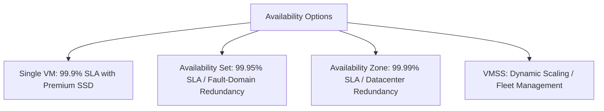

---
content_sources:
  diagrams:
  - id: reference-index-quick-comparison-availability-vs-resiliency
    type: flowchart
    source: self-generated
    description: 'Quick Comparison: Availability vs Resiliency'
    based_on:
    - https://learn.microsoft.com/en-us/azure/virtual-machines/overview
    - https://learn.microsoft.com/en-us/azure/virtual-machines/sizes/overview
    - https://learn.microsoft.com/en-us/azure/virtual-machines/disks-types
    - https://learn.microsoft.com/en-us/azure/virtual-network/virtual-networks-overview
    - https://learn.microsoft.com/en-us/security/benchmark/azure/baselines/virtual-machines-linux-security-baseline
    - https://learn.microsoft.com/en-us/azure/azure-monitor/vm/monitor-vm
    - https://learn.microsoft.com/en-us/azure/backup/backup-azure-vms-introduction
    - https://learn.microsoft.com/en-us/azure/virtual-machines/availability
    justification: Synthesized for this guide from the referenced Microsoft Learn
      documentation.
---

# Reference

This section provides quick-reference tables, comparative overviews, and terminology to help you find specific technical details without navigating through full conceptual documentation.

## Section Contents

| Page | Description |
|------|-------------|
| [VM Size Families](vm-size-families.md) | High-level comparison of size families and workload-specific recommendations. |
| [Managed Disk Types](managed-disk-types.md) | Performance metrics and cost comparisons across all Azure managed disk tiers. |
| [Availability Options](availability-options.md) | Comparison matrix for Single VM, Availability Sets, Zones, and Scale Sets. |
| [Networking Components](networking-components.md) | Summary of VNet, Subnet, NIC, NSG, Load Balancer, and Bastion roles. |
| [Monitoring Signals](monitoring-signals.md) | Identification of metrics, logs, and diagnostics locations across the platform. |
| [Glossary](glossary.md) | A collection of common Azure VM terminology and definitions. |

## Quick Comparison: Availability vs Resiliency

<!-- diagram-id: reference-index-quick-comparison-availability-vs-resiliency -->

!!! tip
    Refer to the **VM Size Families** page before choosing a VM series, as different families (e.g., D-series vs. E-series) are optimized for specific vCPU-to-memory ratios.

## See Also

- [VM Size Families](vm-size-families.md)
- [Managed Disk Types](managed-disk-types.md)
- [Availability Options](availability-options.md)

## Sources
- [Azure Virtual Machines Documentation](https://learn.microsoft.com/en-us/azure/virtual-machines/overview)
- [Virtual Machine Sizes](https://learn.microsoft.com/en-us/azure/virtual-machines/sizes/overview)
- [Managed Disk Types](https://learn.microsoft.com/en-us/azure/virtual-machines/disks-types)
- [Virtual Network Overview](https://learn.microsoft.com/en-us/azure/virtual-network/virtual-networks-overview)
- [Azure Security Baselines](https://learn.microsoft.com/en-us/security/benchmark/azure/baselines/virtual-machines-linux-security-baseline)
- [Monitor Azure Virtual Machines](https://learn.microsoft.com/en-us/azure/azure-monitor/vm/monitor-vm)
- [Introduction to Azure Backup](https://learn.microsoft.com/en-us/azure/backup/backup-azure-vms-introduction)
- [Availability Options for VMs](https://learn.microsoft.com/en-us/azure/virtual-machines/availability)
