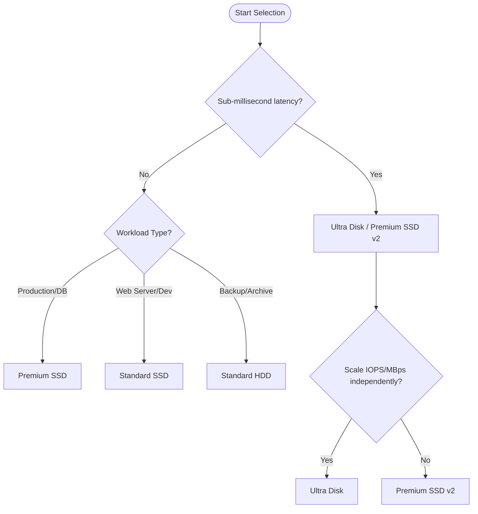

# Managed Disk Types

Azure managed disks offer different performance levels and features. Choosing the right disk type depends on your workload's IOPS, throughput, and latency requirements.

| Disk Type | Max Size | Max IOPS | Max Throughput | Latency | Use Case | Cost Tier |
| :--- | :--- | :--- | :--- | :--- | :--- | :--- |
| **Standard HDD** | 32 TiB | 2,000 | 500 MB/s | Higher and more variable than SSD | Backup, non-critical | Lowest |
| **Standard SSD** | 32 TiB | 6,000 | 750 MB/s | Single-digit ms | Web servers, lightly used apps | Low |
| **Premium SSD** | 32 TiB | 20,000 | 900 MB/s | Single-digit ms | Production, performance-sensitive | Medium |
| **Premium SSD v2** | 64 TiB | 80,000 | 1,200 MB/s | < 1ms | SQL Server, Oracle, NoSQL | Medium-High |
| **Ultra Disk** | 64 TiB | 400,000 | 10,000 MB/s | < 1ms | SAP HANA, transaction-heavy DBs | High |

!!! tip
    Standard SSD and Premium SSD disks support bursting. This allows disks to exceed their provisioned performance for short periods to handle sudden traffic spikes.

## Sources
- [Azure managed disk types](https://learn.microsoft.com/en-us/azure/virtual-machines/disks-types)
- [Standard HDD storage for Azure VMs](https://learn.microsoft.com/en-us/azure/virtual-machines/disks-types#standard-hdd)
- [Standard SSD storage for Azure VMs](https://learn.microsoft.com/en-us/azure/virtual-machines/disks-types#standard-ssd)
- [Premium SSD storage for Azure VMs](https://learn.microsoft.com/en-us/azure/virtual-machines/disks-types#premium-ssd)
- [Premium SSD v2 storage for Azure VMs](https://learn.microsoft.com/en-us/azure/virtual-machines/disks-types#premium-ssd-v2)
- [Ultra Disk storage for Azure VMs](https://learn.microsoft.com/en-us/azure/virtual-machines/disks-types#ultra-disk)
