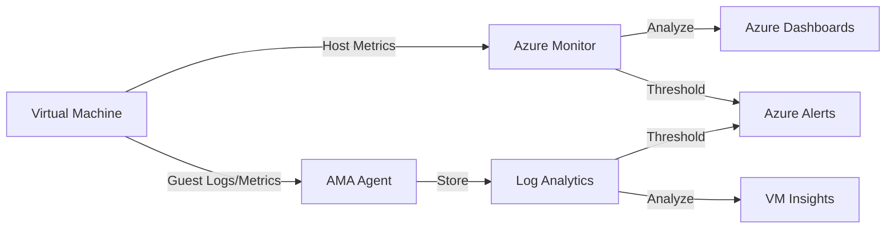

# Monitoring Signals

Azure provides a comprehensive monitoring solution to track the health and performance of your virtual machines. These signals help you proactively identify and resolve issues before they impact your users.

| Signal Category | Metric/Log Name | Source | Normal Range | Alert Threshold | Tool |
| :--- | :--- | :--- | :--- | :--- | :--- |
| **Compute** | Percentage CPU | Host | < 70% | > 85% for 15m | Azure Monitor |
| **Memory** | Available Memory | Guest Agent | > 10% | < 5% | VM Insights |
| **Disk IO** | Data Disk IOPS | Host | Within SKU limit | > 90% of limit | Azure Monitor |
| **Latency** | Disk Read/Write Latency | Host | < 10ms | > 50ms | VM Insights |
| **Network** | Network In/Out | Host | Varies by size | > 90% of BW | Azure Monitor |
| **Health** | VM Availability | Platform | 1 (Available) | < 1 | Resource Health |
| **Diagnosis** | Boot Diagnostics | Serial/Store | Image/Text | "Failure" string | Serial Console |
| **Audit** | Activity Log | Resource | Event log | Critical failures | Log Analytics |

!!! note
    The Azure Monitor Agent (AMA) replaces the legacy Log Analytics agent and provides enhanced security and flexibility for log collection.

## Sources
- [Monitoring Azure virtual machines](https://learn.microsoft.com/en-us/azure/azure-monitor/vm/monitor-virtual-machines)
- [Azure Monitor metrics overview](https://learn.microsoft.com/en-us/azure/azure-monitor/essentials/data-platform-metrics)
- [Azure Monitor Logs overview](https://learn.microsoft.com/en-us/azure/azure-monitor/logs/data-platform-logs)
- [Azure Resource Health overview](https://learn.microsoft.com/en-us/azure/service-health/resource-health-overview)
- [Azure VM boot diagnostics](https://learn.microsoft.com/en-us/azure/virtual-machines/boot-diagnostics)
- [VM Insights overview](https://learn.microsoft.com/en-us/azure/azure-monitor/vm/vminsights-overview)
