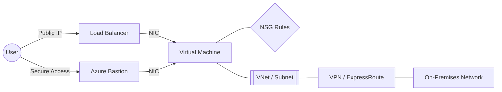

# Networking Components

Azure networking components provide the foundation for virtual machine communication, security, and external access. Understanding their relationships is key to designing a scalable and secure VM infrastructure.

| Component | Purpose | Scope | Key Configuration | Common Pitfall |
| :--- | :--- | :--- | :--- | :--- |
| **VNet** | Isolated private network | Region | Address space (CIDR) | Overlapping IP ranges |
| **Subnet** | Network segmentation | VNet | Address range, Delegation | Range too small for scale |
| **NIC** | VM network interface | Subnet | IP (Static/Dynamic) | Modifying within OS only |
| **NSG** | Traffic filter (L4) | Subnet/NIC | Security rules (Prioritized) | Rule priority overlaps |
| **Public IP** | Internet connectivity | Region | SKU (Standard only; Basic retired 2025-09-30) | Zone-redundant by default |
| **Load Balancer** | L4 traffic distribution | VNet | Health probes, Rules | Forgetting health probe rules |
| **App Gateway** | L7 load balancing | VNet | WAF, Backend pools | Complex certificate setup |
| **Azure Bastion** | Secure RDP/SSH access | VNet | Subnet naming requirement | Using too small a subnet |
| **VPN Gateway** | Site-to-site / Point-to-site | VNet | Gateway type, SKUs | Not planning for SKU limits |
| **ExpressRoute** | Private dedicated circuit | Global | Peering type, Circuit BW | Complex BGP routing |
| **Private Link** | Private service access | Subnet | Private endpoint, DNS | DNS resolution issues |

!!! note
    Azure Bastion requires a dedicated subnet named `AzureBastionSubnet` with at least a `/26` address space.

## See Also

- [Networking Basics](../platform/networking-basics.md)
- [Networking Best Practices](../best-practices/networking-best-practices.md)
- [DNS and Connectivity Issues](../troubleshooting/playbooks/connectivity/dns-and-connectivity-issues.md)

## Sources
- [Azure Virtual Network overview](https://learn.microsoft.com/en-us/azure/virtual-network/virtual-networks-overview)
- [Network security groups overview](https://learn.microsoft.com/en-us/azure/virtual-network/network-security-groups-overview)
- [Azure Load Balancer overview](https://learn.microsoft.com/en-us/azure/load-balancer/load-balancer-overview)
- [Azure Bastion overview](https://learn.microsoft.com/en-us/azure/bastion/bastion-overview)
- [Azure VPN Gateway overview](https://learn.microsoft.com/en-us/azure/vpn-gateway/vpn-gateway-about-vpngateways)
- [Azure Private Link overview](https://learn.microsoft.com/en-us/azure/private-link/private-link-overview)
