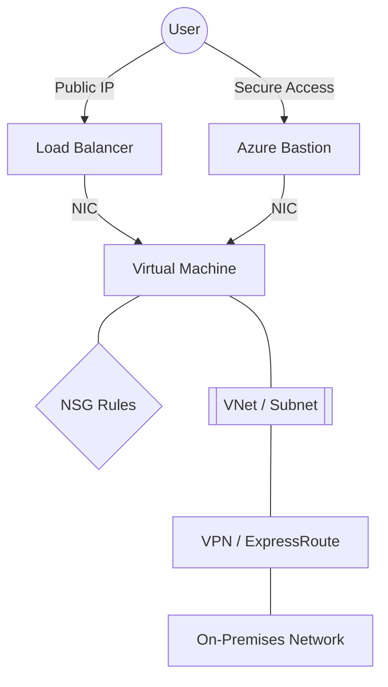

---
content_sources:
  diagrams:
  - id: reference-networking-components-networking-components
    type: flowchart
    source: mslearn-adapted
    description: Networking Components
    based_on:
    - https://learn.microsoft.com/en-us/azure/virtual-network/virtual-networks-overview
    - https://learn.microsoft.com/en-us/azure/virtual-network/network-security-groups-overview
    - https://learn.microsoft.com/en-us/azure/load-balancer/load-balancer-overview
    - https://learn.microsoft.com/en-us/azure/bastion/bastion-overview
    - https://learn.microsoft.com/en-us/azure/vpn-gateway/vpn-gateway-about-vpngateways
    - https://learn.microsoft.com/en-us/azure/private-link/private-link-overview
content_validation:
  status: pending_review
  last_reviewed: '2026-05-22'
  reviewer: ai-agent
  core_claims:
  - claim: Standard public IP addresses can be non-zonal, zonal, or zone-redundant
      depending on region support and SKU behavior.
    source: https://learn.microsoft.com/en-us/azure/virtual-network/ip-services/public-ip-addresses
    verified: false
  - claim: When a Standard public IP is created in a region that supports availability
      zones, zone-redundant is the default availability-zone setting.
    source: https://learn.microsoft.com/en-us/azure/virtual-network/ip-services/virtual-network-public-ip-address
    verified: false
  - claim: Basic public IPs are retired and should be upgraded to Standard SKU.
    source: https://learn.microsoft.com/en-us/azure/virtual-network/ip-services/public-ip-basic-upgrade-guidance
    verified: false
---

# Networking Components

Azure networking components provide the foundation for virtual machine communication, security, and external access. Understanding their relationships is key to designing a scalable and secure VM infrastructure.

| Component | Purpose | Scope | Key Configuration | Common Pitfall |
| :--- | :--- | :--- | :--- | :--- |
| **VNet** | Isolated private network | Region | Address space (CIDR) | Overlapping IP ranges |
| **Subnet** | Network segmentation | VNet | Address range, Delegation | Range too small for scale |
| **NIC** | VM network interface | Subnet | IP (Static/Dynamic) | Modifying within OS only |
| **NSG** | Traffic filter (L4) | Subnet/NIC | Security rules (Prioritized) | Rule priority overlaps |
| **Public IP** | Internet connectivity | Region | SKU (Standard for new designs; Basic retired 2025-09-30) | Standard IPs can be zonal, zone-redundant, or non-zonal depending on region support and creation history |
| **Load Balancer** | L4 traffic distribution | VNet | Health probes, Rules | Forgetting health probe rules |
| **App Gateway** | L7 load balancing | VNet | WAF, Backend pools | Complex certificate setup |
| **Azure Bastion** | Secure RDP/SSH access | VNet | Subnet naming requirement | Using too small a subnet |
| **VPN Gateway** | Site-to-site / Point-to-site | VNet | Gateway type, SKUs | Not planning for SKU limits |
| **ExpressRoute** | Private dedicated circuit | Global | Peering type, Circuit BW | Complex BGP routing |
| **Private Link** | Private service access | Subnet | Private endpoint, DNS | DNS resolution issues |

<!-- diagram-id: reference-networking-components-networking-components -->

```mermaid
graph TD
    User((User)) -->|Public IP| LB[Load Balancer]
    User -->|Secure Access| Bastion[Azure Bastion]
    LB -->|NIC| VM[Virtual Machine]
    Bastion -->|NIC| VM
    VM --- NSG{NSG Rules}
    VM --- VNet[[VNet / Subnet]]
    VNet --- VPN[VPN / ExpressRoute]
    VPN --- OnPrem[On-Premises Network]
```

!!! note "Public IP availability zones"
    Standard public IPs support availability zones, but the exact behavior depends on region and creation mode. In regions that support availability zones, newly created Standard public IPs can be zonal or zone-redundant, and Standard v2 public IPs are zone-redundant. In regions without availability zones, public IPs are non-zonal. Basic public IPs are retired and should not be used for new VM designs.

!!! note
    Azure Bastion requires a dedicated subnet named `AzureBastionSubnet` with at least a `/26` address space for Basic, Standard, and Premium SKUs.

    The Developer SKU is an exception: it uses shared infrastructure and does not require a dedicated subnet or public IP.

## See Also

- [Networking Basics](../platform/networking-basics.md)
- [Networking Best Practices](../best-practices/networking-best-practices.md)
- [DNS and Connectivity Issues](../troubleshooting/playbooks/connectivity/dns-and-connectivity-issues.md)

## Sources
- [Azure Virtual Network overview](https://learn.microsoft.com/en-us/azure/virtual-network/virtual-networks-overview)
- [Network security groups overview](https://learn.microsoft.com/en-us/azure/virtual-network/network-security-groups-overview)
- [Public IP addresses](https://learn.microsoft.com/en-us/azure/virtual-network/ip-services/public-ip-addresses)
- [Create, change, or delete a public IP address](https://learn.microsoft.com/en-us/azure/virtual-network/ip-services/virtual-network-public-ip-address)
- [Upgrade Basic Public IP Address to Standard SKU](https://learn.microsoft.com/en-us/azure/virtual-network/ip-services/public-ip-basic-upgrade-guidance)
- [Azure Load Balancer overview](https://learn.microsoft.com/en-us/azure/load-balancer/load-balancer-overview)
- [Azure Bastion overview](https://learn.microsoft.com/en-us/azure/bastion/bastion-overview)
- [Azure VPN Gateway overview](https://learn.microsoft.com/en-us/azure/vpn-gateway/vpn-gateway-about-vpngateways)
- [Azure Private Link overview](https://learn.microsoft.com/en-us/azure/private-link/private-link-overview)
