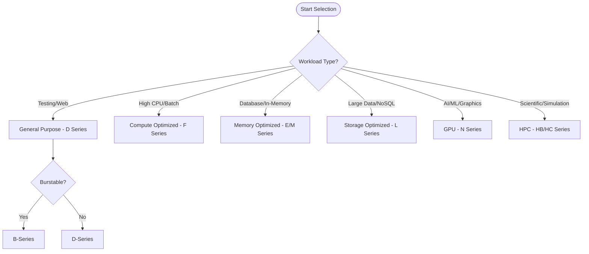

# VM Size Families

Azure offers several virtual machine size families, each tailored to specific workload demands. Use these families to align your compute resources with your application's performance and cost requirements.

| Family | Series | vCPU Range | Memory Range | Primary Use Case | Key Feature |
| :--- | :--- | :--- | :--- | :--- | :--- |
| **General Purpose** | B, D, Dv5 | 1 - 128 | 0.5 GiB - 512 GiB | Testing, small databases, web servers | Balanced CPU-to-memory ratio |
| **Compute Optimized** | F | 2 - 72 | 4 GiB - 144 GiB | Batch processing, web servers, analytics | High CPU-to-memory ratio |
| **Memory Optimized** | E, M | 2 - 416 | 16 GiB - 11,400 GiB | Relational databases, in-memory caches | High memory-to-vCPU ratio |
| **Storage Optimized** | L | 2 - 80 | 16 GiB - 640 GiB | NoSQL databases, data warehousing | High local disk throughput and IOPS |
| **GPU** | N, NC, ND | 6 - 112 | 28 GiB - 880 GiB | Graphics, video editing, deep learning | NVIDIA GPU acceleration |
| **HPC** | HB, HC, HX | 8 - 176 | 32 GiB - 1,400 GiB | Fluid dynamics, seismic processing | InfiniBand networking |

!!! note
    The B-series is ideal for workloads that don't need full CPU performance continuously. These VMs build up credits during idle periods and burst when needed.

## Sources
- [Azure virtual machine sizes](https://learn.microsoft.com/en-us/azure/virtual-machines/sizes)
- [General purpose virtual machine sizes](https://learn.microsoft.com/en-us/azure/virtual-machines/sizes/overview)
- [Compute optimized virtual machine sizes](https://learn.microsoft.com/en-us/azure/virtual-machines/sizes/overview)
- [Memory optimized virtual machine sizes](https://learn.microsoft.com/en-us/azure/virtual-machines/sizes/overview)
- [Storage optimized virtual machine sizes](https://learn.microsoft.com/en-us/azure/virtual-machines/sizes/overview)
- [GPU optimized virtual machine sizes](https://learn.microsoft.com/en-us/azure/virtual-machines/sizes/overview)
- [High performance computing VM sizes](https://learn.microsoft.com/en-us/azure/virtual-machines/sizes/overview#high-performance-compute)
