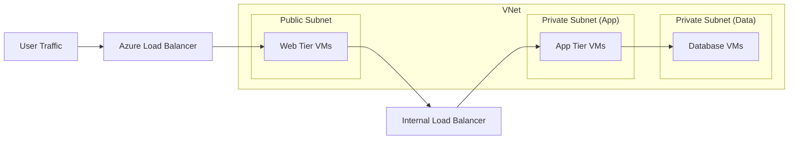

---
hide:
  - toc
---

# Common VM Scenarios

Virtual Machines are versatile and support a wide range of use cases from simple development environments to complex enterprise architectures.

## Scenario Overview Table

| Scenario | Typical VM Family | Key Considerations |
| :--- | :--- | :--- |
| **Development / Test** | B-Series (Burst) | Low cost, manual shutdowns |
| **Web Server (IaaS)** | D-Series (General Purpose) | Security patches, scaling, NSGs |
| **Batch Processing** | F-Series (Compute Optimized) | CPU speed, job scheduling |
| **Database Host** | E-Series (Memory Optimized) | Disk IOPS, high availability |
| **Bastion / Jumpbox** | B-Series (Small) | Restricted access, security hardening |
| **CI/CD Build Agent** | D-Series / F-Series | Fast storage, agent installation |
| **Legacy Apps** | D-Series / older Dv* generations | OS compatibility, static IPs |

!!! warning
    For databases like SQL Server or PostgreSQL, consider Azure SQL Database or Azure Database for PostgreSQL first. They offer managed backups, patching, and high availability out of the box.

## N-Tier Architecture Example

This diagram illustrates how VMs are commonly organized into different security zones.

## Self-Managed Database Hosting

When hosting a database on a VM, you must handle all administrative tasks that a managed service would normally automate.

| Task | Managed (e.g., Azure SQL) | IaaS (SQL on VM) |
| :--- | :---: | :---: |
| OS Patching | Automated | Manual |
| Backups | Automated | Manual / Scripted |
| HA / DR | High | Requires Configuration |
| Cost | Predictable | Dynamic |

## See Also

- [VM vs Other Compute Options](vm-vs-other-compute.md)
- [Production Baseline](../best-practices/production-baseline.md)
- [VM Size Families](../reference/vm-size-families.md)

## Sources

- [Virtual machine sizes in Azure](https://learn.microsoft.com/en-us/azure/virtual-machines/sizes)
- [N-tier architecture with SQL Server](https://learn.microsoft.com/en-us/azure/architecture/reference-architectures/n-tier/n-tier-sql-server)
- [Azure Bastion Documentation](https://learn.microsoft.com/en-us/azure/bastion/bastion-overview)
