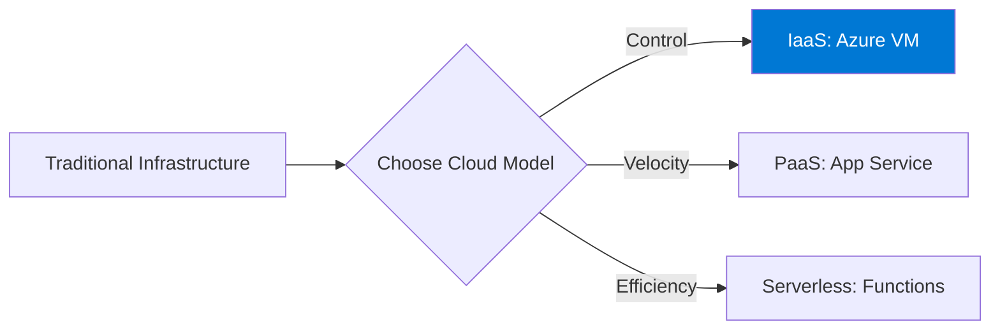

---
hide:
- toc
content_sources:
  diagrams:
  - id: start-here-index-why-virtual-machines
    type: flowchart
    source: self-generated
    description: Why Virtual Machines?
    based_on:
    - https://learn.microsoft.com/en-us/azure/virtual-machines/overview
    - https://learn.microsoft.com/en-us/azure/architecture/guide/technology-choices/compute-decision-tree
    justification: Synthesized for this guide from the referenced Microsoft Learn
      documentation.
---

# Start Here

If you're new to Azure Virtual Machines or wondering where to begin with this guide, this section provides the necessary context and entry points. You'll learn the fundamental value of VMs in a cloud ecosystem and how they compare to other compute services.

## Section Contents

| Page | Description |
|------|-------------|
| [Overview](overview.md) | Understanding Azure VMs as Infrastructure as a Service (IaaS) and their core capabilities. |
| [Learning Path](learning-path.md) | Tailored reading sequences based on your specific role (Architect, Admin, Developer). |
| [VM vs Other Compute](vm-vs-other-compute.md) | How VMs compare to App Service, Azure Functions, and Azure Container Apps. |
| [Common Scenarios](common-scenarios.md) | Practical real-world use cases where VMs are the optimal architectural choice. |

## Why Virtual Machines?

<!-- diagram-id: start-here-index-why-virtual-machines -->

!!! note
    Azure Virtual Machines offer the highest level of control and flexibility among Azure's compute options, making them ideal for legacy migrations and highly customized environments.

## See Also

- [Azure VM Overview](overview.md)
- [Learning Path](learning-path.md)
- [Common VM Scenarios](common-scenarios.md)

## Sources
- [Virtual Machines in Azure](https://learn.microsoft.com/en-us/azure/virtual-machines/overview)
- [Choosing an Azure Compute Service](https://learn.microsoft.com/en-us/azure/architecture/guide/technology-choices/compute-decision-tree)
