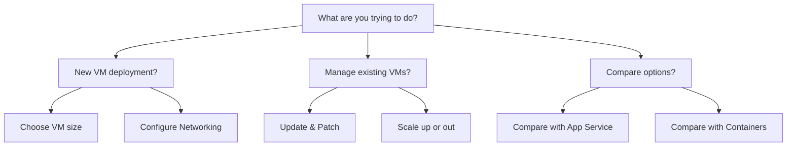

# Learning Path

This guide supports different technical roles and backgrounds. Choose your entry point based on your goals and the operating system you're more comfortable with.

## Role-Based Paths

| Role | Focus Area | Recommended Reading |
| :--- | :--- | :--- |
| **Beginner** | Basic concepts and portal usage | [Overview](./overview.md), [VM vs Other Compute](./vm-vs-other-compute.md) |
| **Operator** | Maintenance, patching, and scaling | [Common Scenarios](./common-scenarios.md), Security sections |
| **Architect** | Design decisions and cost control | [VM vs Other Compute](./vm-vs-other-compute.md), High Availability |
| **Troubleshooter** | Connectivity and diagnostic logs | Boot diagnostics, Networking rules |

## Decision Guide

## Platform Quick Comparison

If you're coming from a specific ecosystem, note these primary differences in VM management.

| Feature | Windows User Path | Linux User Path |
| :--- | :--- | :--- |
| **Primary Access** | RDP (Port 3389) | SSH (Port 22) |
| **Configuration** | PowerShell / Azure Portal | CLI / Cloud-init |
| **Licensing** | Azure Hybrid Benefit available | Mostly BYOL or pay-as-you-go |
| **Storage** | NTFS / ReFS | Ext4 / XFS |

!!! tip
    Use the Azure Bastion service to avoid exposing management ports (RDP/SSH) directly to the public internet.

## Sources

*   [Windows virtual machines in Azure](https://learn.microsoft.com/en-us/azure/virtual-machines/windows/overview)
*   [Linux virtual machines in Azure](https://learn.microsoft.com/en-us/azure/virtual-machines/linux/overview)
*   [Azure Bastion Documentation](https://learn.microsoft.com/en-us/azure/bastion/bastion-overview)
