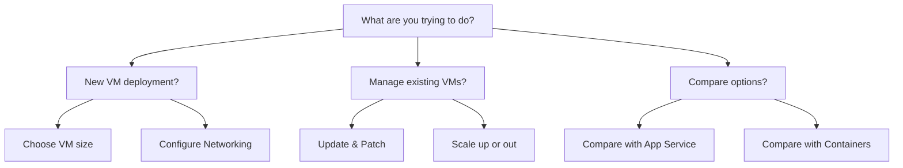

---
content_sources:
  diagrams:
  - id: start-here-learning-path-decision-guide
    type: flowchart
    source: self-generated
    description: Decision Guide
    based_on:
    - https://learn.microsoft.com/en-us/azure/virtual-machines/overview
    - https://learn.microsoft.com/en-us/azure/bastion/bastion-overview
    justification: Synthesized for this guide from the referenced Microsoft Learn
      documentation.
content_validation:
  status: pending_review
  last_reviewed: '2026-05-22'
  reviewer: ai-agent
  core_claims:
  - claim: This document has source metadata and is queued for text-level Microsoft
      Learn verification.
    source: https://learn.microsoft.com/en-us/azure/virtual-machines/overview
    verified: false
  - claim: Core Azure VM guidance on this page should remain traceable to the listed
      sources before it is marked verified.
    source: https://learn.microsoft.com/en-us/azure/virtual-machines/overview
    verified: false
---

# Learning Path

This guide supports different technical roles and backgrounds. Choose your entry point based on your goals and the operating system you're more comfortable with.

## Role-Based Paths

| Role | Focus Area | Recommended Reading |
| :--- | :--- | :--- |
| **Beginner** | Basic concepts and portal usage | [Overview](./overview.md), [VM vs Other Compute](./vm-vs-other-compute.md) |
| **Operator** | Maintenance, patching, and scaling | [Common Scenarios](./common-scenarios.md), Security sections |
| **Architect** | Design decisions and cost control | [VM vs Other Compute](./vm-vs-other-compute.md), High Availability |
| **Troubleshooter** | Connectivity and diagnostic logs | Boot diagnostics, Networking rules |

## Decision Guide

<!-- diagram-id: start-here-learning-path-decision-guide -->

```mermaid
graph TD
    Start[What are you trying to do?] --> Deploy[New VM deployment?]
    Start --> Manage[Manage existing VMs?]
    Start --> Compare[Compare options?]

    Deploy --> Step1[Choose VM size]
    Deploy --> Step2[Configure Networking]

    Manage --> Step3[Update & Patch]
    Manage --> Step4[Scale up or out]

    Compare --> Step5[Compare with App Service]
    Compare --> Step6[Compare with Containers]
```

## Platform Quick Comparison

If you're coming from a specific ecosystem, note these primary differences in VM management.

| Feature | Windows User Path | Linux User Path |
| :--- | :--- | :--- |
| **Primary Access** | RDP (Port 3389) | SSH (Port 22) |
| **Configuration** | PowerShell / Azure Portal | CLI / Cloud-init |
| **Licensing** | Azure Hybrid Benefit available | Mostly BYOL or pay-as-you-go |
| **Storage** | NTFS / ReFS | Ext4 / XFS |

!!! tip
    Use the Azure Bastion service to avoid exposing management ports (RDP/SSH) directly to the public internet.

## See Also

- [Azure VM Overview](overview.md)
- [VM vs Other Compute Options](vm-vs-other-compute.md)
- [Platform Fundamentals](../platform/index.md)

## Sources

- [Azure Virtual Machines overview](https://learn.microsoft.com/en-us/azure/virtual-machines/overview)
- [Azure Bastion Documentation](https://learn.microsoft.com/en-us/azure/bastion/bastion-overview)
