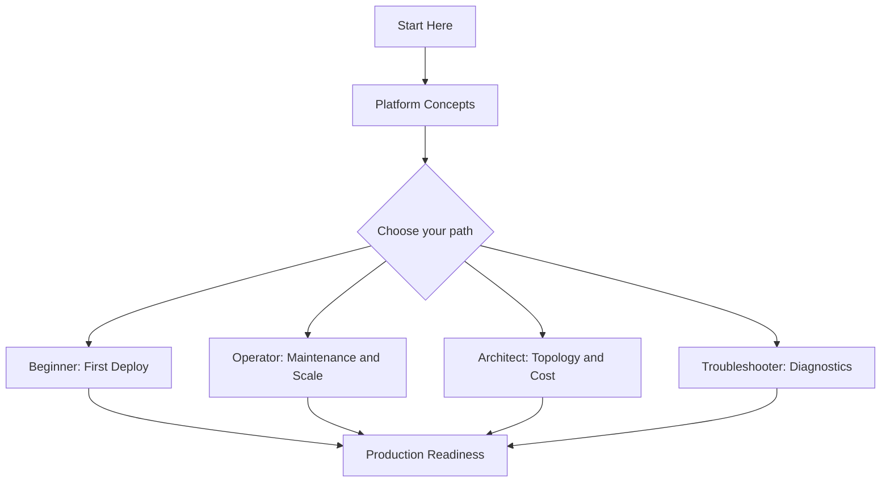
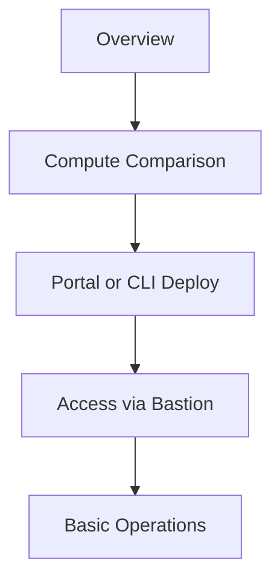
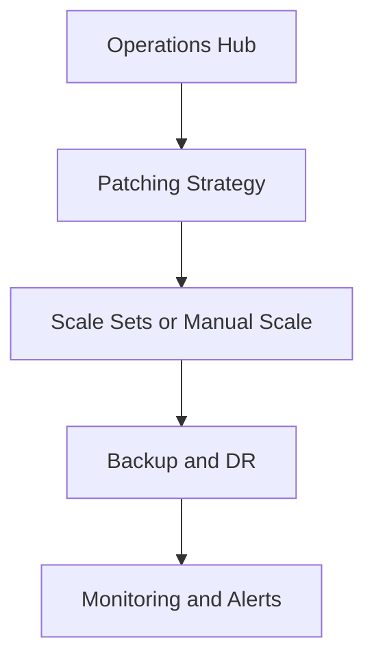
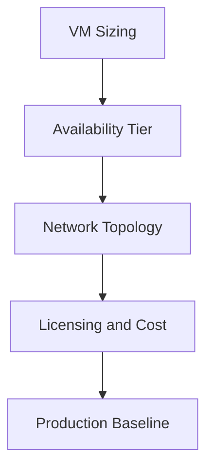
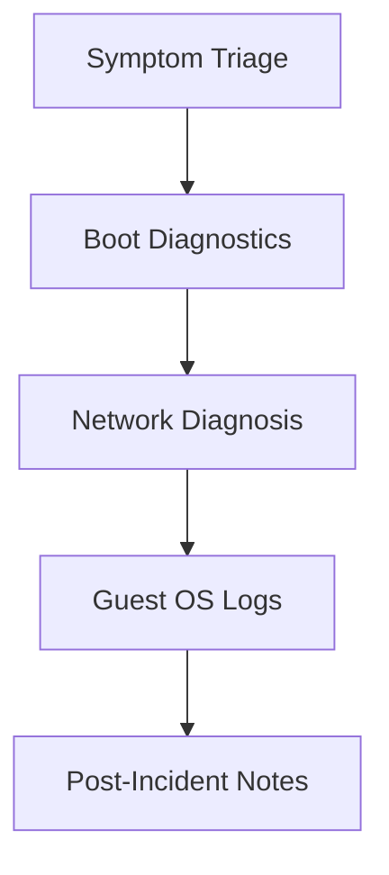

# Learning Paths

Use this page to choose a reading path based on your role and goal. Each path is numbered, so read the pages in order for the best result. Every path ends with a checklist of concrete outcomes you should be able to demonstrate.

!!! tip "Pick one primary path first"
    If you fit multiple roles, pick the one that matches your current goal, complete that path, then read a second path opportunistically. Trying to follow every path in parallel dilutes progress.

## Choose Your Path

| Role | Goal | Time Budget | Start With |
|---|---|---|---|
| **Beginner** | Understand VMs and deploy your first one | 1-2 hours | [Overview](overview.md), [VM vs Other Compute](vm-vs-other-compute.md) |
| **Operator** | Maintain, patch, and scale VMs day-to-day | 3-4 hours | [Scenario Router](scenario-router.md), [Operations Hub](../operations/index.md) |
| **Architect** | Design VM topology, availability, and cost | 4-6 hours | [VM vs Other Compute](vm-vs-other-compute.md), [Best Practices Hub](../best-practices/index.md) |
| **Troubleshooter** | Diagnose connectivity, boot, and performance issues | 2-4 hours + on-call reference | [Troubleshooting Hub](../troubleshooting/index.md), [Platform Hub](../platform/index.md) |

## Recommended Sequence

<!-- diagram-id: vm-learning-paths-overview -->

## Beginner Path

Understand what an Azure VM is, how it differs from other compute options, and how to deploy your first VM through the portal or CLI.

**Time**: 1-2 hours

<!-- diagram-id: vm-learning-paths-beginner -->

Read in order:

1. [Overview](overview.md)
2. [VM vs Other Compute](vm-vs-other-compute.md)
3. [Scenario Router](scenario-router.md)
4. [Platform Hub](../platform/index.md) — VM sizes, disks, images
5. [Reference Hub](../reference/index.md) — CLI cheatsheet

### Outcomes

- You can explain when to use a VM versus App Service, Container Apps, or AKS.
- You can deploy a Windows or Linux VM from the portal.
- You can connect via Bastion instead of exposing RDP/SSH publicly.
- You know where to find CLI reference for automation.

### Microsoft Learn anchors

- [Azure Virtual Machines overview](https://learn.microsoft.com/en-us/azure/virtual-machines/overview)
- [Quickstart: Create a Windows VM](https://learn.microsoft.com/en-us/azure/virtual-machines/windows/quick-create-portal)
- [Azure Bastion overview](https://learn.microsoft.com/en-us/azure/bastion/bastion-overview)

## Operator Path

Run VMs in production: patching, scaling, backups, and routine maintenance.

**Time**: 3-4 hours

<!-- diagram-id: vm-learning-paths-operator -->

Read in order:

1. [Scenario Router](scenario-router.md)
2. [Operations Hub](../operations/index.md) — patching, backups, scaling
3. [Best Practices Hub](../best-practices/index.md) — production baseline
4. [Platform Hub](../platform/index.md) — availability sets, availability zones
5. [Reference Hub](../reference/index.md) — CLI reference for automation

### Outcomes

- You can define a patching cadence with Maintenance Configurations.
- You can configure Azure Backup for a VM and validate restore.
- You can scale a VMSS horizontally based on load.
- You can set up alerts for CPU, memory, and disk pressure.

### Microsoft Learn anchors

- [Maintenance Configurations](https://learn.microsoft.com/en-us/azure/virtual-machines/maintenance-configurations)
- [Back up Azure VMs](https://learn.microsoft.com/en-us/azure/backup/backup-azure-vms-introduction)
- [Virtual Machine Scale Sets](https://learn.microsoft.com/en-us/azure/virtual-machine-scale-sets/overview)

## Architect Path

Design VM topology: sizing, availability tiers, networking, licensing, and cost trade-offs.

**Time**: 4-6 hours

<!-- diagram-id: vm-learning-paths-architect -->

Read in order:

1. [VM vs Other Compute](vm-vs-other-compute.md)
2. [Platform Hub](../platform/index.md) — sizes, disks, availability zones
3. [Best Practices Hub](../best-practices/index.md) — production baseline, cost patterns
4. [Operations Hub](../operations/index.md) — operational implications of topology
5. [Reference Hub](../reference/index.md) — platform limits

### Outcomes

- You can pick a VM size family that matches workload CPU, memory, and storage profile.
- You can decide between availability sets, availability zones, and scale sets.
- You can design network topology with subnets, NSGs, and Bastion for management.
- You can estimate costs using Reserved Instances, Spot, or Azure Hybrid Benefit.

### Microsoft Learn anchors

- [Sizes for virtual machines in Azure](https://learn.microsoft.com/en-us/azure/virtual-machines/sizes)
- [Availability options for Azure VMs](https://learn.microsoft.com/en-us/azure/virtual-machines/availability)
- [Azure Hybrid Benefit](https://learn.microsoft.com/en-us/azure/virtual-machines/windows/hybrid-use-benefit-licensing)

## Troubleshooter Path

Diagnose connectivity, boot, performance, and guest OS issues on Azure VMs.

**Time**: 2-4 hours + on-call reference

<!-- diagram-id: vm-learning-paths-troubleshooter -->

Read in order:

1. [Troubleshooting Hub](../troubleshooting/index.md)
2. [Platform Hub](../platform/index.md) — networking, disks, extensions
3. [Operations Hub](../operations/index.md) — recovery workflows
4. [Scenario Router](scenario-router.md)
5. [Reference Hub](../reference/index.md) — diagnostic CLI reference

### Outcomes

- You can enable boot diagnostics and read the serial console output.
- You can diagnose RDP/SSH connectivity failures using NSG flow logs and effective security rules.
- You can collect guest OS logs from a VM you cannot log into.
- You can decide when to redeploy, resize, or restore a VM from backup.

### Microsoft Learn anchors

- [Boot diagnostics](https://learn.microsoft.com/en-us/azure/virtual-machines/boot-diagnostics)
- [Troubleshoot Azure VMs](https://learn.microsoft.com/en-us/azure/virtual-machines/troubleshooting/)
- [NSG flow logs](https://learn.microsoft.com/en-us/azure/network-watcher/network-watcher-nsg-flow-logging-overview)

## Track Selection Matrix

| Situation | Start with | Then continue to |
|---|---|---|
| First VM in a subscription | Beginner Path | Operator Path |
| Migrating from on-prem | Architect Path | Operator Path |
| Preparing for launch | Operator Path | Troubleshooter Path |
| Active incidents | Troubleshooter Path | Operator Path (hardening) |

!!! tip "Avoid exposing management ports"
    Use Azure Bastion to reach VMs over the private network instead of publishing RDP (3389) or SSH (22) to the internet.

## See Also

- [Azure VM Overview](overview.md)
- [VM vs Other Compute Options](vm-vs-other-compute.md)
- [Scenario Router](scenario-router.md)
- [Platform Hub](../platform/index.md)
- [Operations Hub](../operations/index.md)
- [Best Practices Hub](../best-practices/index.md)
- [Troubleshooting Hub](../troubleshooting/index.md)

## Sources

- [Azure Virtual Machines overview](https://learn.microsoft.com/en-us/azure/virtual-machines/overview)
- [Azure Bastion overview](https://learn.microsoft.com/en-us/azure/bastion/bastion-overview)
- [VM sizes](https://learn.microsoft.com/en-us/azure/virtual-machines/sizes)
- [Availability options](https://learn.microsoft.com/en-us/azure/virtual-machines/availability)
- [Maintenance Configurations](https://learn.microsoft.com/en-us/azure/virtual-machines/maintenance-configurations)
- [Boot diagnostics](https://learn.microsoft.com/en-us/azure/virtual-machines/boot-diagnostics)
