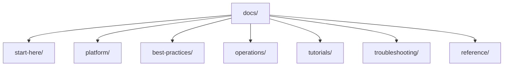

---
content_sources:
  diagrams:
    - id: repository-map
      type: flowchart
      source: self-generated
      justification: "Repository map diagram created for this guide, grounded in Microsoft Learn Azure Virtual Machines overview and Well-Architected service guidance."
      based_on:
        - https://learn.microsoft.com/en-us/azure/virtual-machines/
        - https://learn.microsoft.com/en-us/azure/virtual-machines/overview
        - https://learn.microsoft.com/en-us/azure/well-architected/service-guides/virtual-machines
---

# Repository Map

The Azure Virtual Machine Practical Guide is organized to mirror the workflow of designing, operating, and troubleshooting Azure VMs — from initial deployment through day-2 operations and incident response. This page explains the structure and purpose of each section so you can jump directly to what you need.

<!-- diagram-id: repository-map -->

## Directory Structure

- `docs/start-here/`
    - `overview.md`: Introduction to Azure Virtual Machines and this guide.
    - `learning-paths.md`: Role-based reading paths for architects, administrators, and developers.
    - `repository-map.md`: This file — a map of major sections and when to use them.
    - `vm-vs-other-compute.md`: How VMs compare to App Service, Functions, and Container Apps.
    - `scenario-router.md`: Situation-to-destination router across plan, deploy, operate, and troubleshoot phases.
- `docs/platform/`
    - Core concepts: how Azure VMs work, compute models, VM lifecycle, disks and storage, networking basics, identity and access, availability and resiliency, backup and recovery.
- `docs/best-practices/`
    - Production patterns: production baseline, sizing and image selection, networking, disk and storage, security, patching and maintenance, monitoring, backup and DR, cost optimization, common anti-patterns.
- `docs/operations/`
    - Day-2 execution: create and configure VMs, connect to VMs, manage disks, resize and redeploy, snapshots and images, backup and restore, patching, monitoring and alerting, VMSS basics.
- `docs/tutorials/`
    - Hands-on lab guides: highly available VM deployment, disk encryption and backup, custom script extensions, Azure Bastion and JIT access, VM disaster recovery with ASR.
- `docs/troubleshooting/`
    - Diagnosis-first content: architecture overview, decision tree, evidence map, mental model, quick diagnosis cards, first-10-minutes runbooks, and playbooks for boot, connectivity, and performance scenarios.
- `docs/reference/`
    - Quick-lookup material: VM size families, managed disk types, availability options, networking components, monitoring signals, glossary, and content validation status.

## When to Use Each Section

| If you want to... | Go to |
|---|---|
| Understand Azure VM concepts | [Platform](../platform/index.md) |
| Design a production VM architecture | [Best Practices](../best-practices/index.md) |
| Configure VMs in production | [Operations](../operations/index.md) |
| Practice with a hands-on lab | [Tutorials](../tutorials/index.md) |
| Diagnose a live incident | [Troubleshooting](../troubleshooting/index.md) |
| Look up a decision or command | [Reference](../reference/index.md) |

## See Also

- [Overview](overview.md)
- [Learning Paths](learning-paths.md)
- [VM vs Other Compute](vm-vs-other-compute.md)
- [Scenario Router](scenario-router.md)

## Sources

- [Azure Virtual Machines documentation](https://learn.microsoft.com/en-us/azure/virtual-machines/)
- [Virtual Machines in Azure](https://learn.microsoft.com/en-us/azure/virtual-machines/overview)
- [Well-Architected Framework — Virtual Machines](https://learn.microsoft.com/en-us/well-architected/service-guides/virtual-machines)
