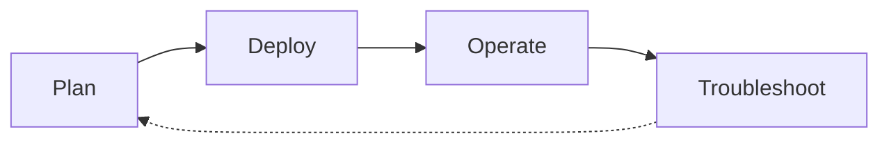

# Scenario Router

Use this page when you have a specific situation and want to jump straight to the page that answers it. This is a breadth-first index across four lifecycle phases — Plan, Deploy, Operate, Troubleshoot — that complements the depth-first [Learning Paths](learning-paths.md) and the symptom-first [Decision Tree](../troubleshooting/decision-tree.md).

!!! tip "Start with Learning Paths if you're new to Azure VMs"
    This page assumes you already know what you're trying to do. If you're still deciding what to learn first, start with [Learning Paths](learning-paths.md) — it sequences a role-based tour of the guide. Use this Scenario Router when you have a specific question and want to jump to the exact page that answers it.

## How to Use This Router

- Pick the table for the lifecycle phase you're in — Plan, Deploy, Operate, or Troubleshoot.
- Scan the left column for the situation that matches yours; open the destination on the right.
- If two rows fit, prefer the row from the phase you're actually in — the same platform concept often appears in more than one phase.
- If your situation spans two phases (a design choice today that will become an incident later), check [Cross-Phase Scenarios](#cross-phase-scenarios) first.
- Every destination is a real page in this guide, not an external link and not an aspirational page.
- Rows are intentionally short. Follow the link for the depth; this table is a switchboard, not a summary.
- If your situation is missing, [open an issue](https://github.com/yeongseon/azure-virtual-machine-practical-guide/issues) — the router is meant to grow.

## Lifecycle Overview

<!-- diagram-id: vm-scenario-router-lifecycle -->

## I'm Planning

| Situation | Where to go |
|---|---|
| I'm choosing which learning path to follow | [Learning Paths](learning-paths.md) — role-based reading paths |
| I want to understand the VM platform architecture | [Platform Hub](../platform/index.md) — how Azure VMs work end-to-end |
| I'm deciding whether a VM fits or a managed service is better | [VM vs Other Compute](vm-vs-other-compute.md) — VM vs App Service, Container Apps, AKS, Functions |
| I'm picking a VM size family for a specific workload | [VM Size Families](../reference/vm-size-families.md) — B/D/E/F series decision table |
| I'm designing for zone-redundancy or availability sets | [Availability and Resiliency](../platform/availability-and-resiliency.md) — SLA, AZ, availability sets |
| I'm choosing disk type and IOPS profile | [Managed Disk Types](../reference/managed-disk-types.md) — Premium SSD, Ultra Disk, IOPS/throughput tiers |
| I'm designing the VNet, NSG, and public-IP topology | [Networking Basics](../platform/networking-basics.md) — subnets, NSGs, private/public IP |
| I want to plan cost before I deploy | [Cost Optimization Best Practices](../best-practices/cost-optimization-best-practices.md) — sizing, reservations, shutdown schedules |
| I'm building the production baseline configuration | [Production Baseline](../best-practices/production-baseline.md) — hardening, patching, monitoring defaults |

## I'm Deploying

| Situation | Where to go |
|---|---|
| I want the quickest possible first VM | [Overview](overview.md) — start-here entry, then [Create and Configure VM](../operations/create-and-configure-vm.md) |
| I need to create and configure a VM end-to-end | [Create and Configure VM](../operations/create-and-configure-vm.md) — CLI + Portal walkthrough |
| I need to connect to my VM (SSH/RDP/Bastion) | [Connect to VM](../operations/connect-to-vm.md) — connection paths and access patterns |
| I'm picking sizing and OS image before create | [Sizing and Image Selection](../best-practices/sizing-and-image-selection.md) — right-sizing and image hardening |
| I'm applying the production-ready security baseline | [Security Best Practices](../best-practices/security-best-practices.md) — identity, disk encryption, JIT, Bastion |
| I'm choosing disk and storage configuration at create time | [Disk and Storage Best Practices](../best-practices/disk-and-storage-best-practices.md) — Premium SSD sizing, caching, host cache |
| I'm designing the networking configuration at deploy time | [Networking Best Practices](../best-practices/networking-best-practices.md) — NSG defaults, public-IP posture, private endpoints |

## I'm Operating in Production

| Situation | Where to go |
|---|---|
| I need day-2 operational procedures | [Operations Hub](../operations/index.md) — production runbooks |
| I want to follow production best practices | [Best Practices Hub](../best-practices/index.md) — hardening and design guidance |
| I need to patch VMs safely (guest OS updates) | [Patching](../operations/patching.md) — Update Manager and maintenance windows |
| I need to resize or redeploy a VM | [Resize and Redeploy](../operations/resize-and-redeploy.md) — SKU change and host-move procedures |
| I need to manage disks (attach, expand, migrate) | [Manage Disks](../operations/manage-disks.md) — data disk lifecycle |
| I'm capturing snapshots or building images | [Snapshots and Images](../operations/snapshots-and-images.md) — snapshot lifecycle and image capture |
| I'm setting up monitoring and alerts | [Monitoring and Alerting](../operations/monitoring-and-alerting.md) — metrics, logs, alert rules |
| I need to configure backup and test restore | [Backup and Restore](../operations/backup-restore.md) — Recovery Services vault and restore drills |
| I'm operating a scale set instead of individual VMs | [VMSS Basics](../operations/vmss-basics.md) — scale-set operations and scaling |

## I'm Troubleshooting

| Situation | Where to go |
|---|---|
| I need to systematically diagnose an issue | [Decision Tree](../troubleshooting/decision-tree.md) — hypothesis-driven triage flow |
| I need to know what evidence to collect | [Evidence Map](../troubleshooting/evidence-map.md) — question → CLI + log artifact index |
| I want quick pattern-match cards for common symptoms | [Quick Diagnosis Cards](../troubleshooting/quick-diagnosis-cards.md) — one-page symptom cards |
| An incident just started and I have 10 minutes | [First 10 Minutes](../troubleshooting/first-10-minutes/index.md) — ordered triage checklist |
| I need to reason about VM subsystems from first principles | [Mental Model](../troubleshooting/mental-model.md) — compute/disk/network layer decomposition |
| My VM won't boot or is stuck in provisioning | [VM Won't Start](../troubleshooting/playbooks/boot-disk/vm-wont-start.md) — boot diagnostics and serial console |
| I can't RDP or SSH into the VM | [Cannot RDP or SSH](../troubleshooting/playbooks/connectivity/cannot-rdp-or-ssh.md) — NSG, JIT, credential paths |
| DNS or outbound connectivity is failing | [DNS and Connectivity Issues](../troubleshooting/playbooks/connectivity/dns-and-connectivity-issues.md) — resolver, egress, private DNS |
| CPU, memory, or disk pressure is degrading my app | [High CPU, Memory, Disk](../troubleshooting/playbooks/performance/high-cpu-memory-disk.md) — signal decomposition |
| A custom script or VM extension is failing | [Extension Failures](../troubleshooting/playbooks/connectivity/extension-failures.md) — extension status and logs |

## Cross-Phase Scenarios

Some situations straddle two phases — the design choice you make while planning determines the failure mode you eventually debug. These rows link the two together so you can see the pattern *and* the drill in one place. If you're only in one phase today, still skim this table: it's the cheapest way to preview which decisions will hurt later.

| Situation | Where to go |
|---|---|
| I'm planning for availability and want to see boot-failure blast radius | [Availability and Resiliency](../platform/availability-and-resiliency.md) then [VM Won't Start](../troubleshooting/playbooks/boot-disk/vm-wont-start.md) — design + failure drill |
| I'm right-sizing a VM and want to see performance-symptom evidence | [Sizing and Image Selection](../best-practices/sizing-and-image-selection.md) then [High CPU, Memory, Disk](../troubleshooting/playbooks/performance/high-cpu-memory-disk.md) — plan + validate |
| I'm designing NSG rules and want to see the RDP/SSH failure path | [Networking Best Practices](../best-practices/networking-best-practices.md) then [Cannot RDP or SSH](../troubleshooting/playbooks/connectivity/cannot-rdp-or-ssh.md) — design + operate |
| I'm setting up backup and want to prove restore actually works | [Backup and DR Best Practices](../best-practices/backup-and-dr-best-practices.md) then [Backup and Restore](../operations/backup-restore.md) — pattern + drill |

## When This Router Isn't the Right Entry Point

- You're brand new to Azure VMs → start with [Learning Paths](learning-paths.md) instead.
- You already have a symptom (VM won't boot, RDP refused, CPU spike) and don't know which lifecycle phase you're in → jump to [Decision Tree](../troubleshooting/decision-tree.md) or [Quick Diagnosis Cards](../troubleshooting/quick-diagnosis-cards.md).
- You're evaluating Azure VMs against a managed compute service → use [VM vs Other Compute](vm-vs-other-compute.md).

## See Also

- [Learning Paths](learning-paths.md) — depth-first, role-based reading order
- [Overview](overview.md) — what Azure VMs are and who this guide is for
- [VM vs Other Compute](vm-vs-other-compute.md) — service selection vs App Service, Container Apps, AKS, Functions
- [Decision Tree](../troubleshooting/decision-tree.md) — symptom-first troubleshooting router
- [Evidence Map](../troubleshooting/evidence-map.md) — evidence-collection index
