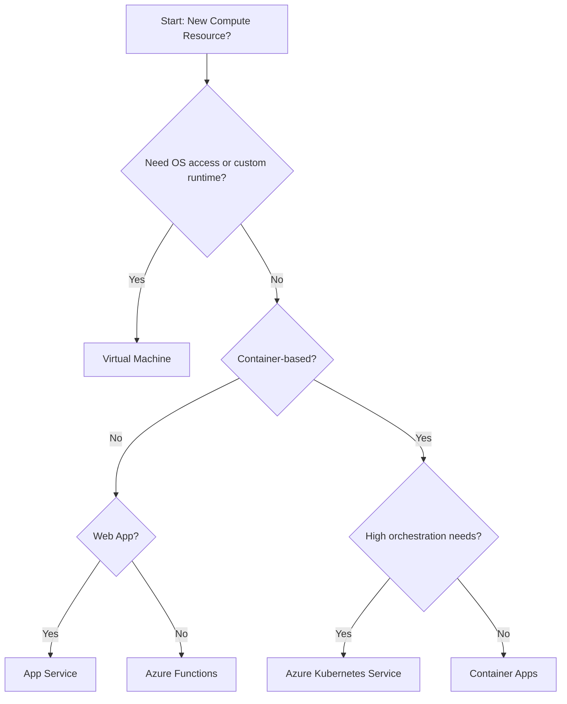

# VM vs Other Compute Options

Azure offers several ways to run your code. Choosing the right service depends on how much control you need and how you prefer to manage your application.

## Detailed Comparison Table

| Feature | Virtual Machines | App Service | Functions | Container Apps | AKS |
| :--- | :--- | :--- | :--- | :--- | :--- |
| **Responsibility** | OS + App | App + Config | Code only | App + Config | Containers + K8s |
| **Scaling** | Manual / VMSS | Auto-scaling | Serverless | Auto / Event-based | K8s HPA/VPA |
| **Cost Model** | Pay-per-hour | Per plan / tier | Per execution | Per consumption | Per node / control plane |
| **Operational Burden** | High | Low | Very Low | Low | High |
| **Best Case** | OS-level control | Web Apps | Short tasks | Microservices | Orchestration |

## Compute Decision Flow

## Judgment Criteria

Use this table to decide if a VM is truly necessary or if it's overkill for your task.

| Criteria | Choose Virtual Machine (Necessary) | Choose PaaS / Serverless (Overkill) |
| :--- | :--- | :--- |
| **Control** | Need deep OS-level access or custom kernel | Only need to run code or standard runtime |
| **Migration** | Legacy "lift-and-shift" without code changes | Modernized or cloud-native code |
| **Dependencies** | Specialized COM+ or legacy GAC assemblies | Standard web or containerized libraries |
| **Hardware** | GPU or specific high-memory SKU needs | Standard CPU/RAM requirements |

!!! warning
    Running a single web app on a VM means you are responsible for OS patching, firewall rules, and web server configuration. App Service handles these for you automatically.

## Sources

- [Choose an Azure compute service](https://learn.microsoft.com/en-us/azure/architecture/guide/technology-choices/compute-decision-tree)
- [Compare Azure compute options](https://learn.microsoft.com/en-us/azure/architecture/guide/technology-choices/compute-comparison)
