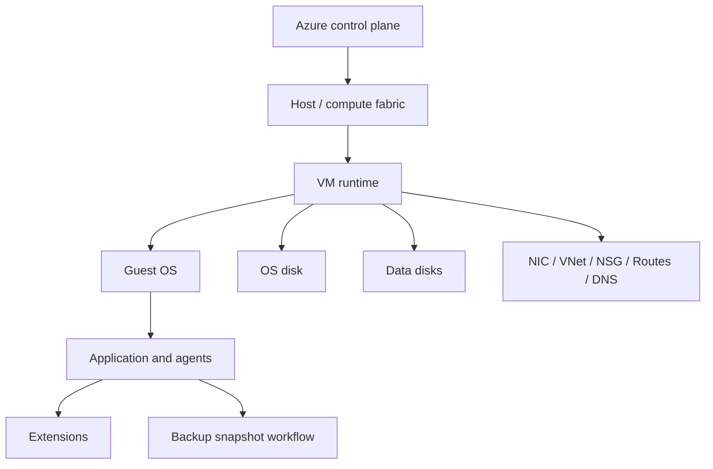
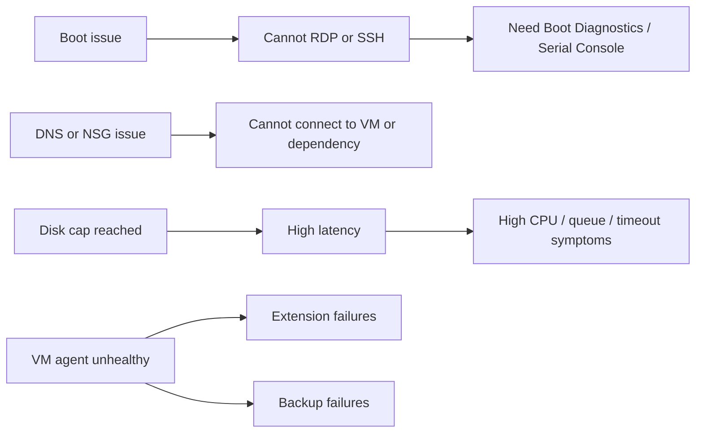

---
hide:
- toc
content_sources:
  diagrams:
  - id: troubleshooting-architecture-overview-failure-domain-overview
    type: flowchart
    source: self-generated
    description: Failure-domain overview
    based_on:
    - https://learn.microsoft.com/en-us/azure/virtual-machines/
    - https://learn.microsoft.com/en-us/azure/virtual-machines/boot-diagnostics
    - https://learn.microsoft.com/en-us/azure/azure-monitor/vm/monitor-virtual-machine
    justification: Synthesized for this guide from the referenced Microsoft Learn
      documentation.
  - id: troubleshooting-architecture-overview-common-fault-chains
    type: flowchart
    source: self-generated
    description: Common fault chains
    based_on:
    - https://learn.microsoft.com/en-us/azure/virtual-machines/
    - https://learn.microsoft.com/en-us/azure/virtual-machines/boot-diagnostics
    - https://learn.microsoft.com/en-us/azure/azure-monitor/vm/monitor-virtual-machine
    justification: Synthesized for this guide from the referenced Microsoft Learn
      documentation.
---

# VM Troubleshooting Architecture Overview

This page maps the Azure VM control plane, data plane, guest OS, and storage/network dependencies so you can place failures in the right layer before opening a playbook.

## Failure-domain overview

<!-- diagram-id: troubleshooting-architecture-overview-failure-domain-overview -->

## Where incidents usually start

| Layer | Typical Failure Modes | First Evidence |
|---|---|---|
| Azure control plane | failed start, resize, redeploy, extension orchestration | Activity Log, provisioning state |
| Host / compute fabric | allocation failure, host maintenance, unavailable size | Activity Log, instance view |
| Guest OS boot | boot loop, kernel panic, BCD/GRUB corruption, driver regression | Boot Diagnostics, Serial Console |
| Network path | NSG deny, UDR misroute, DNS failure, guest firewall | Network Watcher, effective routes, guest checks |
| Disk path | IOPS or throughput cap, caching mismatch, snapshot lock | Azure Monitor disk metrics, disk config |
| Guest runtime | CPU saturation, memory pressure, paging, process lockup | VM Insights, Task Manager, top, perfmon, iostat |
| Agent-dependent features | extension failure, backup failure, Run Command issue | VM agent state, extension logs |

## Architectural thinking model

1. **Classify the symptom surface**: connect, perform, boot, or recover.
2. **Decide whether the first clue is outside or inside the guest**.
3. **Confirm the dependency chain**: host, disk, network, guest, agent.
4. **Only then** choose the canonical playbook.

## Common fault chains

<!-- diagram-id: troubleshooting-architecture-overview-common-fault-chains -->

## What this means for routing

- **Connectivity** playbooks are for administrative access, DNS, route, and VM-agent-dependent control paths.
- **Performance** playbooks are for CPU, memory, disk, and saturation or throttling patterns.
- **Boot and disk recovery** playbooks are for startup, boot repair, serial-console-led diagnosis, and backup/snapshot recovery paths.

## See Also

- [Decision Tree](decision-tree.md)
- [Evidence Map](evidence-map.md)
- [Mental Model](mental-model.md)
- [Playbooks](playbooks/index.md)

## Sources

- [Azure Virtual Machines documentation](https://learn.microsoft.com/en-us/azure/virtual-machines/)
- [Understand boot diagnostics](https://learn.microsoft.com/en-us/azure/virtual-machines/boot-diagnostics)
- [Monitor virtual machines with Azure Monitor](https://learn.microsoft.com/en-us/azure/azure-monitor/vm/monitor-virtual-machine)
