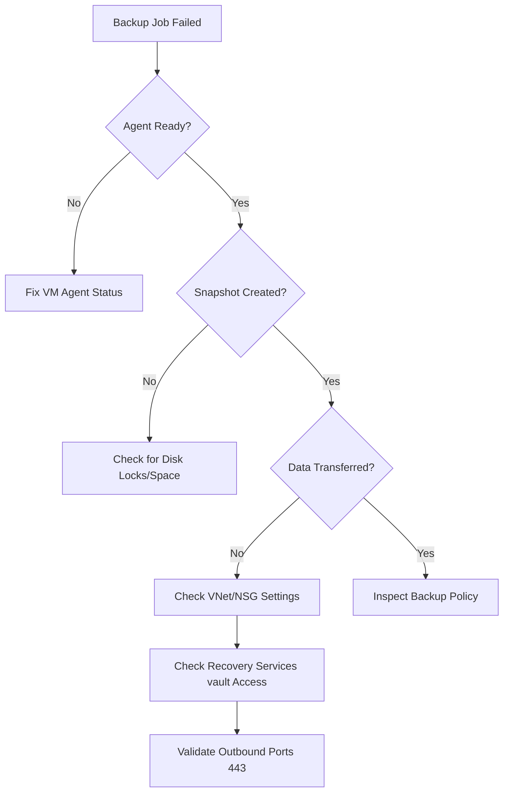

---
hide:
  - toc
---

# Backup Failures

Azure Backup failures usually stem from communication issues between the VM and the Recovery Services vault or disk snapshot errors. Identifying the error code is the first step in resolving backup disruptions.

## Backup Error Diagnosis

| Error Code / Symptom | Cause | Resolution |
| :--- | :--- | :--- |
| UserErrorVmNotReady | VM agent not responding | Start/Update VM agent or restart VM |
| ExtensionNotResponding | VMSnapshot extension failed | Reinstall extension and check disk IO |
| UserErrorDiskLock | Resource lock on VM disk | Remove Azure resource locks from disk/group |
| ConnectivityFailure | Blocked vault communication | Allow required outbound endpoints (service tags / FQDNs) over port 443 |
| UserErrorSnapshotLimit | Excess managed snapshots | Delete old manual snapshots or increase limit |

## Backup Failure Logic

!!! note
    Azure Backup requires the `VMSnapshot` extension to be healthy for application-consistent backups.

!!! tip
    Use the "Backup Pre-check" in the Azure portal to identify potential configuration issues before the next scheduled job runs.

## See Also

- [Backup and Restore](../operations/backup-restore.md)
- [Backup and DR Best Practices](../best-practices/backup-and-dr-best-practices.md)
- [Extension Failures](extension-failures.md)

## Sources
- [Troubleshoot Azure VM backup failures](https://learn.microsoft.com/en-us/azure/backup/backup-azure-vms-troubleshoot)
- [Troubleshoot VM Agent and extensions](https://learn.microsoft.com/en-us/azure/backup/backup-azure-troubleshoot-vm-backup-fails-snapshot-timeout)
- [Support matrix for Azure VM backup](https://learn.microsoft.com/en-us/azure/backup/backup-support-matrix-iaas)
