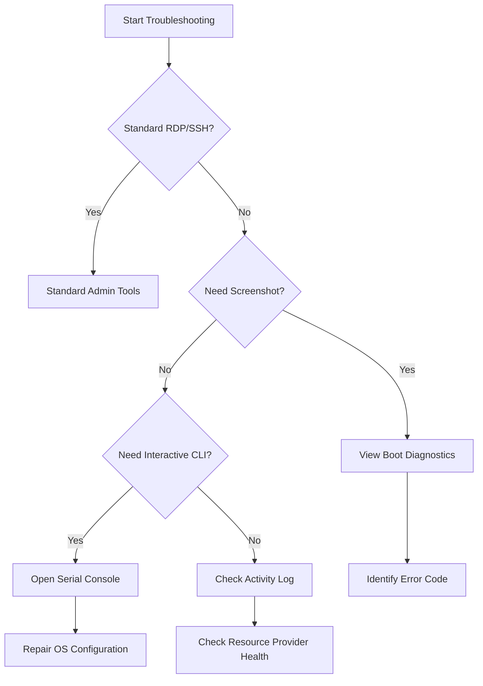

---
hide:
- toc
content_sources:
  diagrams:
  - id: troubleshooting-boot-diagnostics-and-serial-console-diagnostic-tool-decision-flow
    type: flowchart
    source: mslearn-adapted
    description: Diagnostic Tool Decision Flow
    based_on:
    - https://learn.microsoft.com/en-us/azure/virtual-machines/boot-diagnostics
    - https://learn.microsoft.com/en-us/troubleshoot/azure/virtual-machines/serial-console-windows
    - https://learn.microsoft.com/en-us/troubleshoot/azure/virtual-machines/serial-console-linux
---

# Boot Diagnostics and Serial Console

Boot diagnostics and the serial console are critical for troubleshooting Azure VMs when standard network-based access (RDP/SSH) is unavailable. These tools provide visibility into the earliest stages of the virtual machine life cycle.

## Diagnostic Tools Matrix

| Tool | Access Method | When to Use | Prerequisites |
| :--- | :--- | :--- | :--- |
| Boot Diagnostics | Azure Portal (Screenshot/Log) | Visualizing boot errors or hangs. | Enabled by default (uses managed storage). |
| Serial Console | Azure Portal (Interactive) | Direct console access without networking. | Boot Diagnostics enabled; password-authenticated user account; VM Contributor access. |
| Activity Log | Azure Portal (Events) | Tracking platform-level start/stop events. | Azure Role-Based Access Control. |

!!! note
    Serial Console requires an account with VM Contributor permissions and the "Microsoft.SerialConsole/serialPorts/connect/action" permission.

## Diagnostic Tool Decision Flow

<!-- diagram-id: troubleshooting-boot-diagnostics-and-serial-console-diagnostic-tool-decision-flow -->

!!! tip
    If the Serial Console shows a blank screen, try pressing "Enter" to refresh the login prompt or use the "Send NMI" button for Windows kernel debugging.

## See Also

- [VM Won't Start](vm-wont-start.md)
- [Connect to VM](../operations/connect-to-vm.md)
- [VM Lifecycle](../platform/vm-lifecycle.md)

## Sources
- [How to use Azure boot diagnostics](https://learn.microsoft.com/en-us/azure/virtual-machines/boot-diagnostics)
- [Azure Serial Console for Windows](https://learn.microsoft.com/en-us/troubleshoot/azure/virtual-machines/serial-console-windows)
- [Azure Serial Console for Linux](https://learn.microsoft.com/en-us/troubleshoot/azure/virtual-machines/serial-console-linux)
