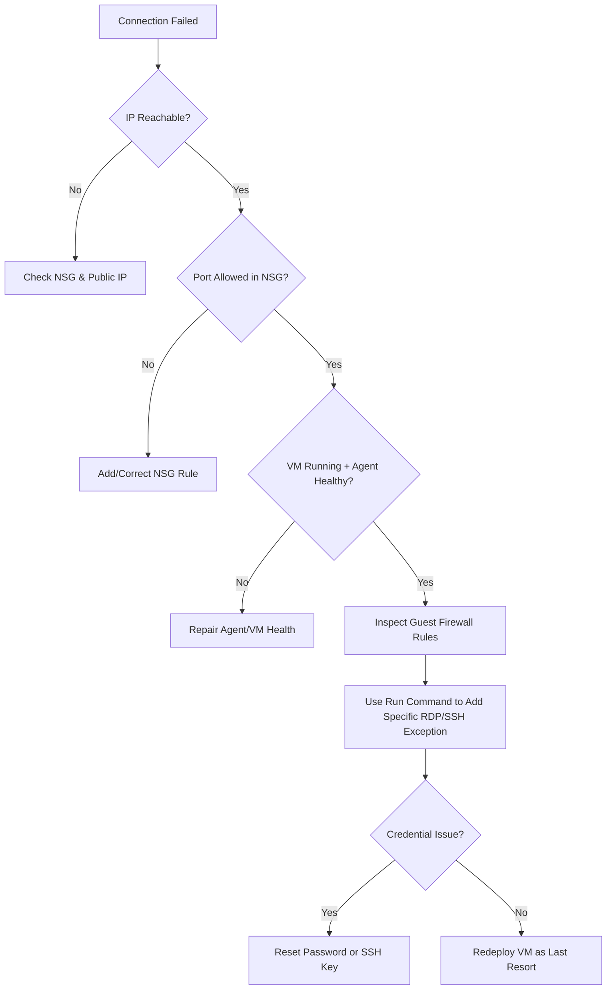

# Cannot RDP or SSH

Connectivity issues often stem from Network Security Group (NSG) misconfigurations, guest OS firewalls, or routing errors. Follow this guide to diagnose and resolve access failures.

## Connectivity Diagnosis Matrix

| Symptom | Check | Resolution |
| :--- | :--- | :--- |
| Connection timeout | NSG Inbound Rules | Allow TCP 3389 (RDP) or 22 (SSH). |
| Connection refused | Guest OS Firewall Rules | Verify rules via Serial Console, then add specific allow rule only for required port. |
| Access Denied | Credentials / VM Agent Status | Reset password or SSH key, then verify VM Agent health. |
| Intermittent drops | Network Path | Check Route Table or NVA constraints. |

!!! warning
    Opening RDP or SSH ports directly to the Internet is a security risk. Use Azure Bastion or a VPN for secure administrative access.

## Connectivity Flowchart

!!! tip
    If standard tools fail, Azure Bastion provides browser-based access over SSL (port 443), bypassing many local network restrictions.

!!! note
    Keep the local firewall enabled. Use Serial Console for inspection and Run Command for targeted, auditable RDP/SSH rule changes.

## See Also

- [Connect to VM](../operations/connect-to-vm.md)

## Sources
- [Troubleshoot RDP connections to an Azure VM](https://learn.microsoft.com/en-us/troubleshoot/azure/virtual-machines/troubleshoot-rdp-connection)
- [Troubleshoot SSH connections to an Azure Linux VM](https://learn.microsoft.com/en-us/troubleshoot/azure/virtual-machines/troubleshoot-ssh-connection)
- [Azure Bastion documentation](https://learn.microsoft.com/en-us/azure/bastion/bastion-overview)
