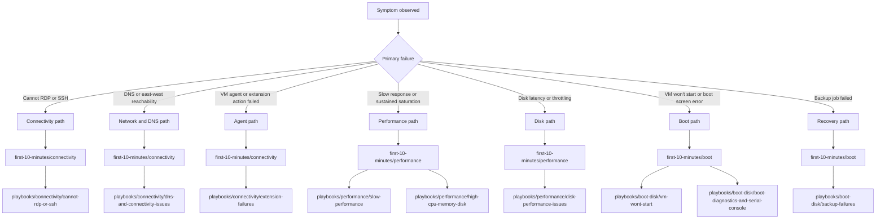

---
content_sources:
  diagrams:
  - id: troubleshooting-decision-tree-symptom-routing
    type: flowchart
    source: self-generated
    description: Symptom routing
    based_on:
    - https://learn.microsoft.com/en-us/troubleshoot/azure/virtual-machines/welcome-virtual-machines
    - https://learn.microsoft.com/en-us/azure/virtual-machines/troubleshooting/
    justification: Synthesized for this guide from the referenced Microsoft Learn
      documentation.
---

# Troubleshooting Decision Tree

Use this page to route an observed VM symptom to the most relevant first-response checklist and canonical playbook.

## Symptom routing

<!-- diagram-id: troubleshooting-decision-tree-symptom-routing -->

## Decision rules

| If you see | Start here | Then open |
|---|---|---|
| timeout, refused, credential, or admin access failure | [Connectivity checklist](first-10-minutes/connectivity.md) | [Cannot RDP or SSH](playbooks/connectivity/cannot-rdp-or-ssh.md) |
| name resolution failure, peering issue, or route mismatch | [Connectivity checklist](first-10-minutes/connectivity.md) | [DNS and Connectivity Issues](playbooks/connectivity/dns-and-connectivity-issues.md) |
| provisioning failed on extension or VM agent action | [Connectivity checklist](first-10-minutes/connectivity.md) | [Extension Failures](playbooks/connectivity/extension-failures.md) |
| app or VM is slow, but root cause unclear | [Performance checklist](first-10-minutes/performance.md) | [Slow Performance](playbooks/performance/slow-performance.md) |
| one resource is clearly saturated | [Performance checklist](first-10-minutes/performance.md) | [High CPU / Memory / Disk](playbooks/performance/high-cpu-memory-disk.md) |
| storage latency or throttling dominates | [Performance checklist](first-10-minutes/performance.md) | [Disk Performance Issues](playbooks/performance/disk-performance-issues.md) |
| VM never reaches healthy boot state | [Boot checklist](first-10-minutes/boot.md) | [VM Won't Start](playbooks/boot-disk/vm-wont-start.md) |
| you need screen or console evidence before networking works | [Boot checklist](first-10-minutes/boot.md) | [Boot Diagnostics and Serial Console](playbooks/boot-disk/boot-diagnostics-and-serial-console.md) |
| backup job or snapshot workflow failed | [Boot checklist](first-10-minutes/boot.md) | [Backup Failures](playbooks/boot-disk/backup-failures.md) |

## See Also

- [Architecture Overview](architecture-overview.md)
- [Quick Diagnosis Cards](quick-diagnosis-cards.md)
- [First 10 Minutes](first-10-minutes/index.md)
- [Playbooks](playbooks/index.md)

## Sources

- [Troubleshoot Azure virtual machines](https://learn.microsoft.com/en-us/troubleshoot/azure/virtual-machines/welcome-virtual-machines)
- [Azure VM troubleshooting overview](https://learn.microsoft.com/en-us/azure/virtual-machines/troubleshooting/)
