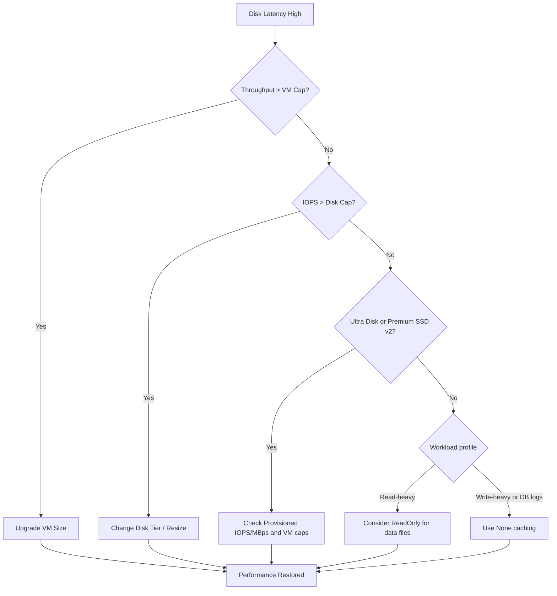

# Disk Performance Issues

Azure Managed Disks have specific limits for Input/Output Operations Per Second (IOPS) and throughput based on the disk tier and VM size. Throttling occurs when the workload exceeds either the individual disk cap or the VM-level aggregate cap.

## Disk Tier Performance Matrix

| Disk Tier | Max IOPS | Max Throughput | Typical Throttling Trigger |
| :--- | :--- | :--- | :--- |
| Standard HDD | 2,000 | 500 MB/s | Heavy sequential/random I/O. |
| Standard SSD | 6,000 | 750 MB/s | Burst capacity depleted. |
| Premium SSD | 20,000 | 900 MB/s | Consistent high-load exceeded. |
| Ultra Disk | 400,000 | 10,000 MB/s | Configured limit reached. |

!!! warning
    Disk throughput is limited by both the disk performance and the VM size throughput limit. A Premium SSD can only reach its full potential if the VM size supports it.

## Disk Throttling Diagnosis Flow

!!! tip
    Database transaction logs should use **None** caching. Caching logs can increase write latency variability and increase risk during crash scenarios.

!!! note
    If you use **Ultra Disk** or **Premium SSD v2**, host caching settings are ignored because those disk types do not support host caching. Focus troubleshooting on provisioned disk performance (IOPS/throughput) and VM-level limits.

## Quick Caching Reference for Troubleshooting

| Disk Role | Recommended Caching | Troubleshooting Rationale |
| :--- | :--- | :--- |
| OS Disk | ReadWrite (default) | Improves OS responsiveness |
| Database data files | ReadOnly (when read-heavy) | Can improve read latency |
| Database transaction logs | None (always) | Preserves write durability behavior |
| Ultra Disk / Premium SSD v2 | Not applicable | Host caching unsupported |

## Sources
- [Azure Managed Disks performance](https://learn.microsoft.com/en-us/azure/virtual-machines/disks-performance)
- [Disk throttling in Azure VMs](https://learn.microsoft.com/en-us/troubleshoot/azure/virtual-machines/troubleshoot-performance-bottlenecks-linux)
- [Select the best disk tier for your workload](https://learn.microsoft.com/en-us/azure/virtual-machines/disks-types)
