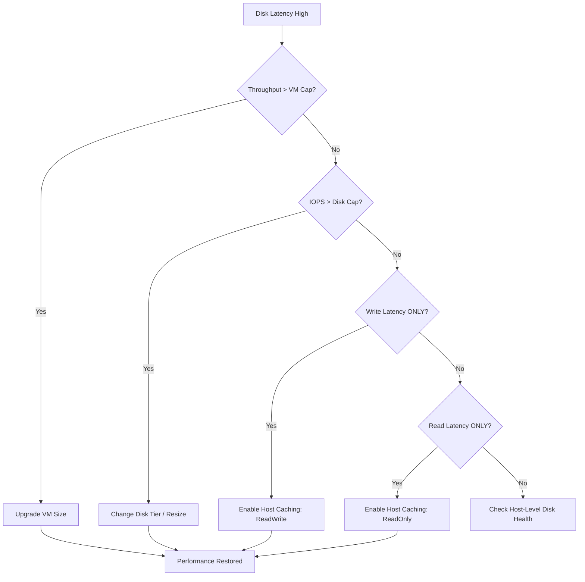

# Disk Performance Issues

Azure Managed Disks have specific limits for Input/Output Operations Per Second (IOPS) and throughput based on the disk tier and VM size. Throttling occurs when the workload exceeds either the individual disk cap or the VM-level aggregate cap.

## Disk Tier Performance Matrix

| Disk Tier | Max IOPS | Max Throughput | When Throttled |
| :--- | :--- | :--- | :--- |
| Standard HDD | 500 | 60 MB/s | Heavy sequential/random I/O. |
| Standard SSD | 6,000 | 750 MB/s | Burst capacity depleted. |
| Premium SSD | 20,000 | 900 MB/s | Consistent high-load exceeded. |
| Ultra Disk | 160,000 | 4,000 MB/s | Configured limit reached. |

!!! warning
    Disk throughput is limited by both the disk performance and the VM size throughput limit. A Premium SSD can only reach its full potential if the VM size supports it.

## Disk Throttling Diagnosis Flow

!!! tip
    Use Premium SSDs with "ReadOnly" caching for database log files and "ReadWrite" for OS disks to improve performance while maintaining data integrity.

## Sources
- [Azure Managed Disks performance](https://learn.microsoft.com/en-us/azure/virtual-machines/disks-performance)
- [Disk throttling in Azure VMs](https://learn.microsoft.com/en-us/troubleshoot/azure/virtual-machines/troubleshoot-disk-performance)
- [Select the best disk tier for your workload](https://learn.microsoft.com/en-us/azure/virtual-machines/disks-types)
