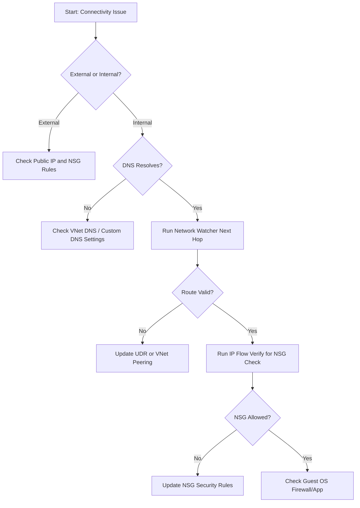

# DNS and Connectivity Issues

Effective troubleshooting in Azure requires isolating issues between internal DNS resolution and the underlying network fabric. This guide maps common connectivity failures to their diagnostic tools and root causes.

## Connectivity Troubleshooting Matrix

| Issue Type | Diagnostic Tool | Common Cause | Resolution |
| :--- | :--- | :--- | :--- |
| DNS Resolution | `nslookup` / `dig` | Custom DNS IP mismatch | Update VNet DNS settings or VM client config |
| VNet Peering | Network Watcher Next Hop | Peering state "Disconnected" | Re-establish peering or check for overlapping IP space |
| Traffic Blocked | IP Flow Verify | Misconfigured NSG rule | Adjust Security Group inbound/outbound rules |
| Routing Error | Next Hop | Incorrect User Defined Route (UDR) | Modify Route Table to point to correct Virtual Appliance |
| Connection Drop | Connection Troubleshoot | Destination port closed | Verify guest OS firewall and application listening status |

## Network Diagnostics Flow

!!! note
    Azure-provided DNS uses `168.63.129.16` for internal name resolution. If using custom DNS, ensure this IP is reachable or fallback is configured.

!!! tip
    Use Network Watcher Connection Troubleshoot to perform a comprehensive check of the entire network path between two endpoints.

## Sources
- [Troubleshoot DNS resolution issues](https://learn.microsoft.com/en-us/azure/dns/dns-troubleshoot)
- [Troubleshoot VNet peering issues](https://learn.microsoft.com/en-us/azure/virtual-network/virtual-network-troubleshoot-peering-issues)
- [Network Watcher IP flow verify overview](https://learn.microsoft.com/en-us/azure/network-watcher/network-watcher-ip-flow-verify-overview)
