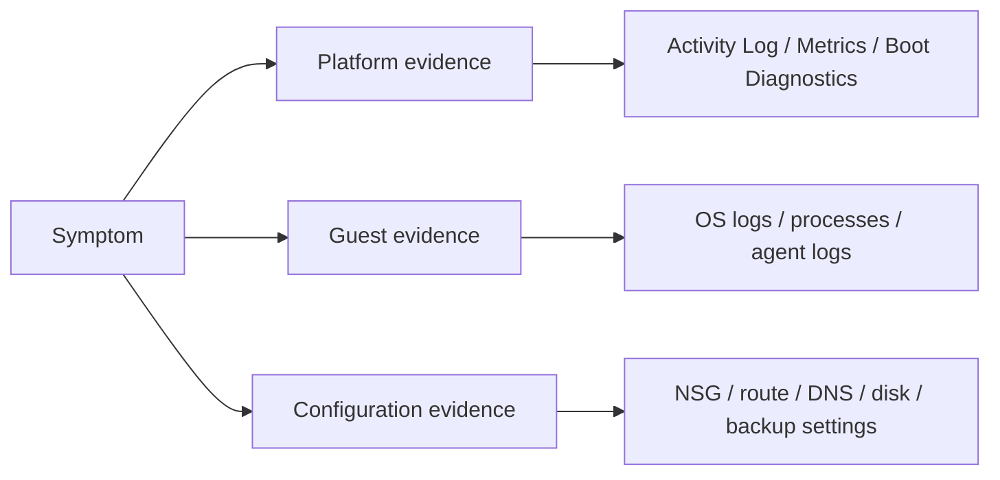
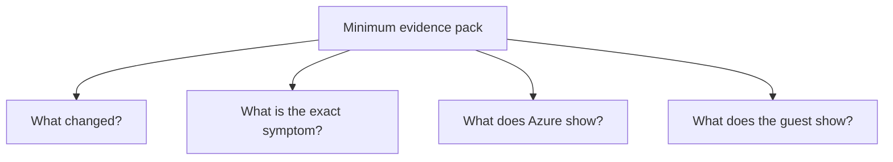

# Evidence Map

This evidence map shows what to collect first for each VM troubleshooting domain so investigations do not stall on low-value data.

## Evidence flow

## Evidence matrix

| Domain | Evidence to Collect First | Why it matters | Typical tools |
|---|---|---|---|
| Connectivity | reachability result, NSG/effective rules, effective routes, guest firewall state, credential path | separates network-path issues from guest-auth issues | Network Watcher, effective security rules, Serial Console, Run Command |
| DNS / east-west network | name resolution output, next hop, peering state, custom DNS settings | proves whether failure is lookup, route, or policy | `nslookup`, `dig`, Next Hop, Connection Troubleshoot |
| Extensions | VM agent status, extension provisioning state, extension logs, outbound access to Azure endpoints | distinguishes bad payload from agent or connectivity failure | instance view, extension logs, `waagent`, WindowsAzure logs |
| Performance | CPU, memory, disk latency, network, timestamps, top processes | identifies actual bottleneck instead of guessing | VM Insights, Azure Monitor, Task Manager, top, perfmon |
| Disk performance | disk IOPS, throughput, queue depth, caching mode, VM size limits | validates throttling versus guest workload issue | disk metrics, `iostat`, disk configuration |
| Boot | boot screenshot, serial log, last successful change, Activity Log | tells whether VM fails before admin access is possible | Boot Diagnostics, Serial Console, Activity Log |
| Backup | vault job error, VM agent state, snapshot/lock state, outbound requirements | separates vault workflow, disk lock, and agent failure | Backup jobs, extension logs, resource locks, VM agent checks |

## Collection priorities

1. **Timestamp window**: when the incident started and whether a change preceded it.
2. **Outside-the-guest evidence**: platform state, metrics, diagnostics artifacts.
3. **Inside-the-guest evidence**: process, log, firewall, service state.
4. **Dependency and configuration evidence**: disk, route, DNS, backup, extensions.

## Minimum evidence pack

- Exact error text or screenshot
- Incident start time and recent changes
- Azure metrics or Activity Log for the same window
- Guest or serial-console output, if available

## See Also

- [Decision Tree](decision-tree.md)
- [Mental Model](mental-model.md)
- [Playbooks](playbooks/index.md)

## Sources

- [Monitor Azure virtual machines](https://learn.microsoft.com/en-us/azure/azure-monitor/vm/monitor-virtual-machine)
- [Use Azure Network Watcher](https://learn.microsoft.com/en-us/azure/network-watcher/network-watcher-monitoring-overview)
- [Troubleshoot Azure VM backup failures](https://learn.microsoft.com/en-us/azure/backup/backup-azure-vms-troubleshoot)
