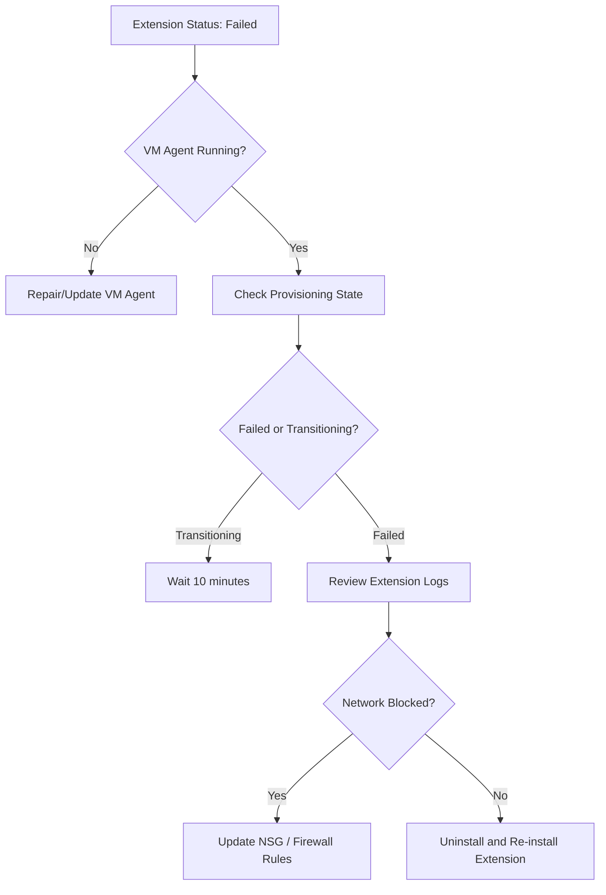

---
hide:
  - toc
---

# Extension Failures

Azure VM extensions are small applications that provide post-deployment configuration and automation tasks. If an extension fails to install or run, the VM provisioning state may change to "Failed".

## Extension Error Reference

| Extension | Common Error | Log Location | Fix |
| :--- | :--- | :--- | :--- |
| Custom Script | Timeout / Access Denied | `C:\Packages\Plugins\Microsoft.Compute.CustomScriptExtension\` | Check script accessibility and retry policy |
| Azure Monitor Agent | Installation failure | `/var/log/azure/Microsoft.Azure.Monitor.AzureMonitorLinuxAgent/` | Verify OS version support and outbound network |
| IaaS Antimalware | Dependency missing | `C:\WindowsAzure\Logs\Plugins\Microsoft.Azure.Security.IaaSAntimalware` | Ensure VM agent is updated and running |
| Dependency Agent | Kernel mismatch | `/var/log/azure/Microsoft.Azure.Monitoring.DependencyAgent/` | Update OS kernel or extension version |
| VMSnapshot | Disk lock / IO freeze | `C:\WindowsAzure\Logs\Plugins\Microsoft.Azure.RecoveryServices.VMSnapshot` | Check for disk space and volume consistency |

## Extension Troubleshooting Flow

!!! warning
    Extensions often require access to Azure storage or metadata services. Blocking `168.63.129.16` will break most extensions.

!!! tip
    The VM Agent must be in a "Ready" state before extensions can be successfully provisioned or updated.

## See Also

- [Create and Configure VM](../operations/create-and-configure-vm.md)
- [Monitoring and Alerting](../operations/monitoring-and-alerting.md)
- [Backup Failures](backup-failures.md)

## Sources
- [Troubleshoot Azure VM extension failures](https://learn.microsoft.com/en-us/azure/virtual-machines/extensions/troubleshoot)
- [Custom Script Extension for Windows](https://learn.microsoft.com/en-us/azure/virtual-machines/extensions/custom-script-windows)
- [Azure Monitor Agent troubleshooting](https://learn.microsoft.com/en-us/azure/azure-monitor/agents/troubleshoot-agent-windows)
