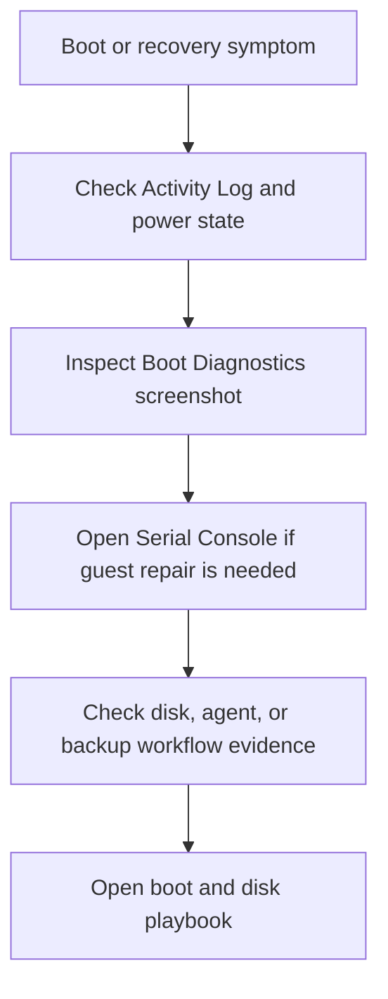

---
content_sources:
  diagrams:
  - id: troubleshooting-first-10-minutes-boot-initial-response-flow
    type: flowchart
    source: self-generated
    description: Initial response flow
    based_on:
    - https://learn.microsoft.com/en-us/azure/virtual-machines/boot-diagnostics
    - https://learn.microsoft.com/en-us/troubleshoot/azure/virtual-machines/serial-console-linux
    - https://learn.microsoft.com/en-us/azure/backup/backup-azure-vms-troubleshoot
    justification: Synthesized for this guide from the referenced Microsoft Learn
      documentation.
---

# Boot Checklist

Use this checklist when the VM does not reach a healthy running state, standard admin access is unavailable, or backup recovery workflows are failing.

## Initial response flow

<!-- diagram-id: troubleshooting-first-10-minutes-boot-initial-response-flow -->

## Checklist

1. Confirm whether the issue is allocation, boot, screenshot error, or backup failure.
2. Check Activity Log for start, redeploy, resize, host, or snapshot failures.
3. Inspect Boot Diagnostics before attempting more network-based fixes.
4. Use Serial Console when guest boot or firewall repair is required.
5. If backup is affected, record the exact vault error code and VM agent state.
6. Avoid repeated restart attempts without new evidence.

## Route to playbook

| Situation | Playbook |
|---|---|
| VM will not start or is stuck in boot | [VM Won't Start](../playbooks/boot-disk/vm-wont-start.md) |
| Need low-level boot evidence or console repair | [Boot Diagnostics and Serial Console](../playbooks/boot-disk/boot-diagnostics-and-serial-console.md) |
| Azure Backup or snapshot path failed | [Backup Failures](../playbooks/boot-disk/backup-failures.md) |

## See Also

- [Architecture Overview](../architecture-overview.md)
- [Decision Tree](../decision-tree.md)
- [Playbooks](../playbooks/index.md)

## Sources

- [How to use Azure boot diagnostics](https://learn.microsoft.com/en-us/azure/virtual-machines/boot-diagnostics)
- [Azure Serial Console for Linux](https://learn.microsoft.com/en-us/troubleshoot/azure/virtual-machines/serial-console-linux)
- [Troubleshoot Azure VM backup failures](https://learn.microsoft.com/en-us/azure/backup/backup-azure-vms-troubleshoot)
