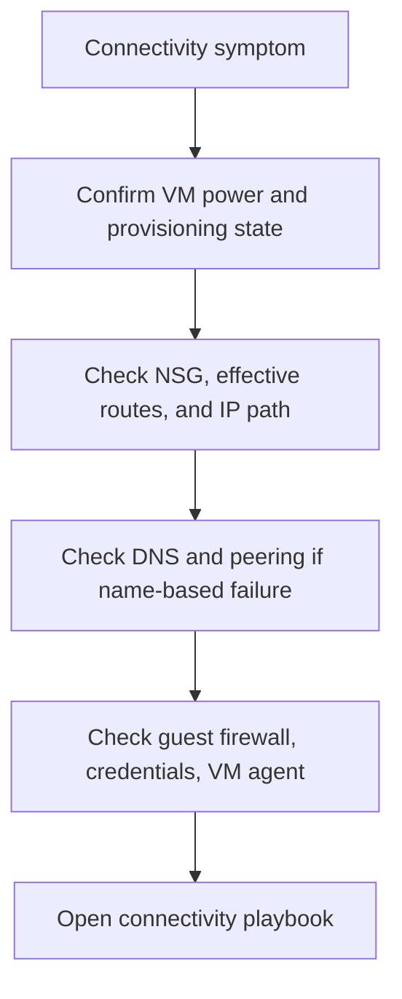

---
hide:
  - toc
---

# Connectivity Checklist

Use this checklist during the first 10 minutes of incidents where RDP, SSH, DNS, routes, or extension operations fail.

## Initial response flow

## Checklist

1. Confirm the exact symptom: timeout, refused, auth failure, or name resolution.
2. Verify VM power state and provisioning state in portal or `az vm get-instance-view`.
3. Check NSG effective rules, public/private IP path, and effective routes.
4. If DNS is involved, validate VNet DNS settings and guest resolver behavior.
5. If extension or Run Command is involved, confirm VM agent is healthy.
6. Preserve the first error text before changing rules.

## Route to playbook

| Situation | Playbook |
|---|---|
| Cannot connect via RDP/SSH | [Cannot RDP or SSH](../playbooks/connectivity/cannot-rdp-or-ssh.md) |
| DNS or internal connectivity issue | [DNS and Connectivity Issues](../playbooks/connectivity/dns-and-connectivity-issues.md) |
| VM extension failed | [Extension Failures](../playbooks/connectivity/extension-failures.md) |

## See Also

- [Decision Tree](../decision-tree.md)
- [Evidence Map](../evidence-map.md)
- [Playbooks](../playbooks/index.md)

## Sources

- [Troubleshoot RDP connections to an Azure VM](https://learn.microsoft.com/en-us/troubleshoot/azure/virtual-machines/troubleshoot-rdp-connection)
- [Troubleshoot SSH connections to an Azure Linux VM](https://learn.microsoft.com/en-us/troubleshoot/azure/virtual-machines/troubleshoot-ssh-connection)
- [Azure Network Watcher overview](https://learn.microsoft.com/en-us/azure/network-watcher/network-watcher-monitoring-overview)
