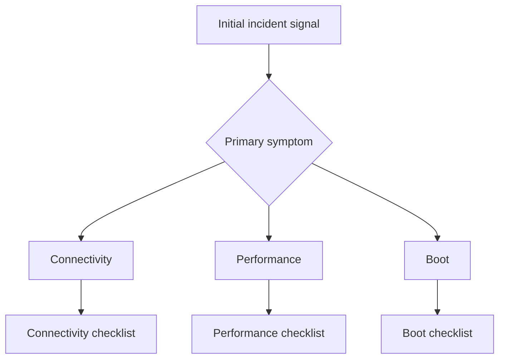

# First 10 Minutes

These checklists help you stabilize triage, collect the first evidence, and route to the correct VM playbook before making disruptive changes.

## Triage flow

| Checklist | Use when |
|---|---|
| [Connectivity](connectivity.md) | Cannot RDP/SSH, DNS or route failure, extension provisioning problem |
| [Performance](performance.md) | Slow VM, high latency, high utilization, disk or network bottleneck |
| [Boot](boot.md) | VM will not start, boot loop, serial-console-led repair, backup recovery issue |

## See Also

- [Decision Tree](../decision-tree.md)
- [Quick Diagnosis Cards](../quick-diagnosis-cards.md)
- [Playbooks](../playbooks/index.md)

## Sources

- [Troubleshoot Azure virtual machines](https://learn.microsoft.com/en-us/troubleshoot/azure/virtual-machines/welcome-virtual-machines)
