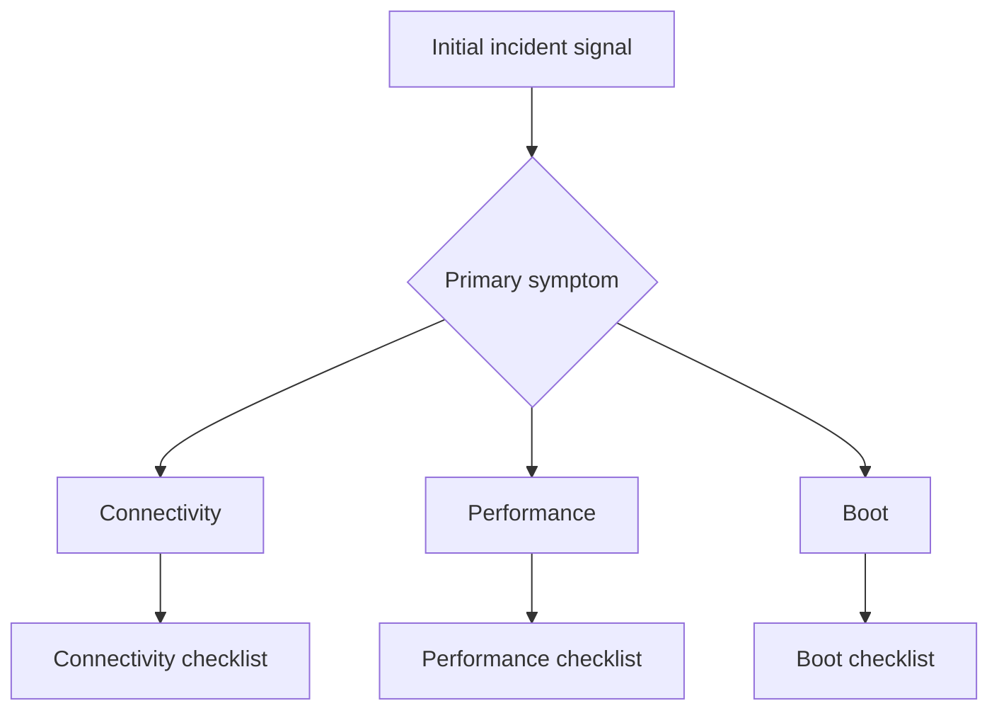

---
content_sources:
  diagrams:
  - id: troubleshooting-first-10-minutes-index-triage-flow
    type: flowchart
    source: self-generated
    description: Triage flow
    based_on:
    - https://learn.microsoft.com/en-us/troubleshoot/azure/virtual-machines/welcome-virtual-machines
    justification: Synthesized for this guide from the referenced Microsoft Learn
      documentation.
content_validation:
  status: pending_review
  last_reviewed: '2026-05-22'
  reviewer: ai-agent
  core_claims:
  - claim: This document has source metadata and is queued for text-level Microsoft
      Learn verification.
    source: https://learn.microsoft.com/en-us/troubleshoot/azure/virtual-machines/welcome-virtual-machines
    verified: false
  - claim: Core Azure VM guidance on this page should remain traceable to the listed
      sources before it is marked verified.
    source: https://learn.microsoft.com/en-us/troubleshoot/azure/virtual-machines/welcome-virtual-machines
    verified: false
---

# First 10 Minutes

These checklists help you stabilize triage, collect the first evidence, and route to the correct VM playbook before making disruptive changes.

## Triage flow

<!-- diagram-id: troubleshooting-first-10-minutes-index-triage-flow -->

```mermaid
graph TD
    A[Initial incident signal] --> B{Primary symptom}
    B --> C[Connectivity]
    B --> D[Performance]
    B --> E[Boot]
    C --> F[Connectivity checklist]
    D --> G[Performance checklist]
    E --> H[Boot checklist]
```

| Checklist | Use when |
|---|---|
| [Connectivity](connectivity.md) | Cannot RDP/SSH, DNS or route failure, extension provisioning problem |
| [Performance](performance.md) | Slow VM, high latency, high utilization, disk or network bottleneck |
| [Boot](boot.md) | VM will not start, boot loop, serial-console-led repair, backup recovery issue |

## See Also

- [Decision Tree](../decision-tree.md)
- [Quick Diagnosis Cards](../quick-diagnosis-cards.md)
- [Playbooks](../playbooks/index.md)

## Sources

- [Troubleshoot Azure virtual machines](https://learn.microsoft.com/en-us/troubleshoot/azure/virtual-machines/welcome-virtual-machines)
