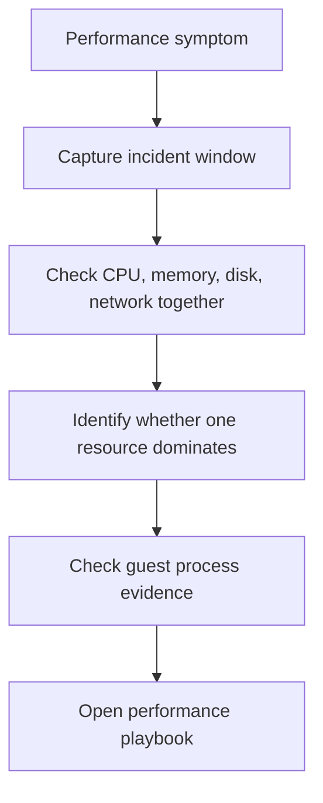

# Performance Checklist

Use this checklist when a VM is slow, saturated, intermittently timing out, or showing resource pressure.

## Initial response flow

## Checklist

1. Capture start time, recent deployment/change, and affected workload.
2. Pull Azure Monitor metrics for CPU, disk, network, and if available guest memory.
3. Check whether the issue is global slowness, one saturated resource, or disk-specific throttling.
4. Collect guest evidence with Task Manager, perfmon, `top`, `free -m`, or `iostat`.
5. Check whether B-series credit depletion or VM-size caps are in scope.
6. Route to one canonical playbook before resizing blindly.

## Route to playbook

| Situation | Playbook |
|---|---|
| General performance problem, bottleneck unclear | [Slow Performance](../playbooks/performance/slow-performance.md) |
| CPU, memory, or disk obviously saturated | [High CPU / Memory / Disk](../playbooks/performance/high-cpu-memory-disk.md) |
| Disk latency, IOPS, or throughput issue dominates | [Disk Performance Issues](../playbooks/performance/disk-performance-issues.md) |

## See Also

- [Evidence Map](../evidence-map.md)
- [Mental Model](../mental-model.md)
- [Playbooks](../playbooks/index.md)

## Sources

- [Monitor Azure virtual machines](https://learn.microsoft.com/en-us/azure/azure-monitor/vm/monitor-virtual-machine)
- [Troubleshoot performance bottlenecks on Azure VMs](https://learn.microsoft.com/en-us/troubleshoot/azure/virtual-machines/troubleshoot-performance-bottlenecks-linux)
