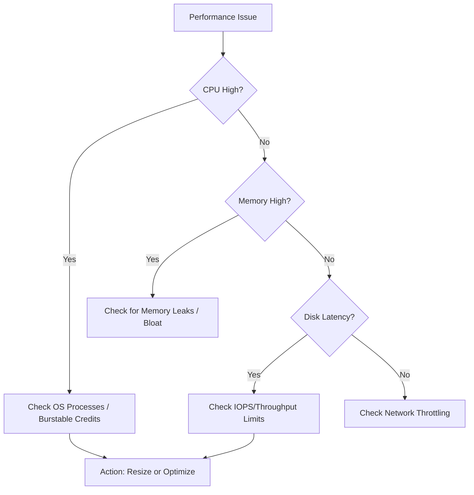

# High CPU / Memory / Disk

Performance degradation in Azure VMs is often caused by resource exhaustion. This guide details how to correlate Azure platform metrics with guest OS processes to resolve performance bottlenecks.

## Resource Performance Analysis

| Resource | Azure Metric | Threshold | Guest OS Tool | Action |
| :--- | :--- | :--- | :--- | :--- |
| CPU | Percentage CPU | >85% sustained | Task Manager / `top` | Resize VM or optimize app code |
| Memory | Available Memory | <100 MB | Resource Monitor / `free` | Add RAM or fix memory leaks |
| Disk IO | Disk Queue Depth | >2 per disk | Perfmon / `iostat` | Upgrade to Premium/Ultra SSD |
| Network | Network Out/In | Host limit | `netstat` / `nload` | Move to Accelerated Networking |
| Credits | CPU Credits Consumed | 0 credits | Azure Portal | Change to non-burstable VM size |

## Resource Usage Troubleshooting

!!! note
    B-series VMs use credits for CPU bursts. If credits are exhausted, performance is capped at the baseline.

!!! tip
    Premium SSDs and Ultra Disks provide consistent IOPS. Standard HDDs/SSDs can experience high latency during peak usage.

## See Also

- [Slow Performance](slow-performance.md)
- [Disk Performance Issues](disk-performance-issues.md)
- [Monitoring and Alerting](../operations/monitoring-and-alerting.md)

## Sources
- [Troubleshoot high CPU on Windows VMs](https://learn.microsoft.com/en-us/troubleshoot/azure/virtual-machines/windows/troubleshoot-high-cpu-issues-azure-windows-vm)
- [Troubleshoot high CPU on Linux VMs](https://learn.microsoft.com/en-us/troubleshoot/azure/virtual-machines/troubleshoot-performance-bottlenecks-linux)
- [Understand VM disk throttling](https://learn.microsoft.com/en-us/azure/virtual-machines/disks-performance-tiers)
