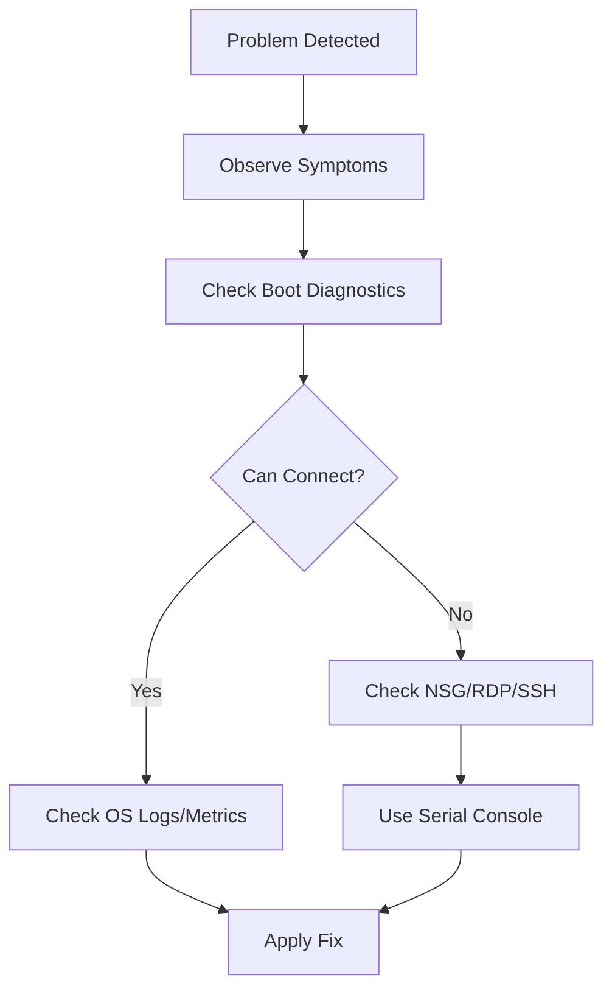

# Troubleshooting

This section provides symptom-based diagnostic workflows and resolution guides. We focus on starting from observed behaviors and systematically verifying potential causes to minimize downtime.

## Section Contents

| Symptom | Guide |
|---------|-------|
| VM fails to start | [VM Won't Start](vm-wont-start.md) |
| Cannot connect via RDP/SSH | [Cannot RDP or SSH](cannot-rdp-or-ssh.md) |
| Need to view boot logs or screen | [Boot Diagnostics and Serial Console](boot-diagnostics-and-serial-console.md) |
| General system slowness | [Slow Performance](slow-performance.md) |
| Disk-related performance drops | [Disk Performance Issues](disk-performance-issues.md) |
| DNS or network connectivity errors | [DNS and Connectivity Issues](dns-and-connectivity-issues.md) |
| VM Extension installation/run failures | [Extension Failures](extension-failures.md) |
| Azure Backup job failures | [Backup Failures](backup-failures.md) |
| High resource utilization (CPU/RAM) | [High CPU / Memory / Disk](high-cpu-memory-disk.md) |

## Diagnostic Flow

!!! tip
    When a VM is unreachable, always check the **Boot Diagnostics** screenshot first. It will often reveal if the OS is stuck at a blue screen, a kernel panic, or a login prompt.

## Sources
- [Troubleshoot Azure VM connectivity](https://learn.microsoft.com/en-us/azure/virtual-machines/troubleshooting/connectivity-overview)
- [Azure VM Boot Diagnostics](https://learn.microsoft.com/en-us/azure/virtual-machines/boot-diagnostics)
- [Troubleshoot VM extension issues](https://learn.microsoft.com/en-us/azure/virtual-machines/extensions/troubleshoot)
