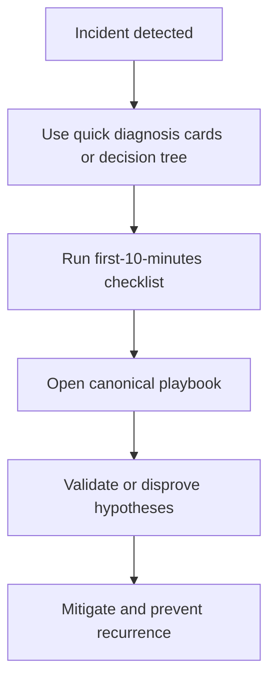
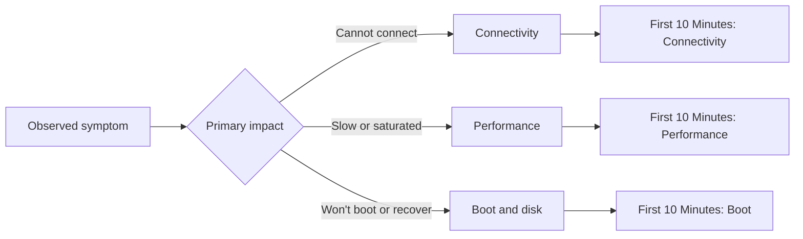

---
hide:
- toc
content_sources:
  diagrams:
  - id: troubleshooting-index-how-this-section-works
    type: flowchart
    source: self-generated
    description: How this section works
    based_on:
    - https://learn.microsoft.com/en-us/azure/virtual-machines/
    - https://learn.microsoft.com/en-us/troubleshoot/azure/virtual-machines/welcome-virtual-machines
    justification: Synthesized for this guide from the referenced Microsoft Learn
      documentation.
  - id: troubleshooting-index-quick-routing-view
    type: flowchart
    source: self-generated
    description: Quick Routing View
    based_on:
    - https://learn.microsoft.com/en-us/azure/virtual-machines/
    - https://learn.microsoft.com/en-us/troubleshoot/azure/virtual-machines/welcome-virtual-machines
    justification: Synthesized for this guide from the referenced Microsoft Learn
      documentation.
---

# Troubleshooting

Hypothesis-driven troubleshooting for Azure Virtual Machines: classify the symptom, collect the right evidence, then move into a canonical playbook.

## How this section works

<!-- diagram-id: troubleshooting-index-how-this-section-works -->

## Start Here

| Need | Go To |
|---|---|
| Understand VM failure domains first | [Architecture Overview](architecture-overview.md) |
| Route a symptom to the right playbook | [Decision Tree](decision-tree.md) |
| Know what evidence to collect | [Evidence Map](evidence-map.md) |
| Build a troubleshooting mindset | [Mental Model](mental-model.md) |
| Triage in under 60 seconds | [Quick Diagnosis Cards](quick-diagnosis-cards.md) |
| Work the first incident minutes | [First 10 Minutes](first-10-minutes/index.md) |
| Jump straight to deep-dive guides | [Playbooks](playbooks/index.md) |

## Troubleshooting Domains

### Connectivity
- [Cannot RDP or SSH](playbooks/connectivity/cannot-rdp-or-ssh.md)
- [DNS and Connectivity Issues](playbooks/connectivity/dns-and-connectivity-issues.md)
- [Extension Failures](playbooks/connectivity/extension-failures.md)

### Performance
- [Slow Performance](playbooks/performance/slow-performance.md)
- [High CPU / Memory / Disk](playbooks/performance/high-cpu-memory-disk.md)
- [Disk Performance Issues](playbooks/performance/disk-performance-issues.md)

### Boot and Disk Recovery
- [VM Won't Start](playbooks/boot-disk/vm-wont-start.md)
- [Boot Diagnostics and Serial Console](playbooks/boot-disk/boot-diagnostics-and-serial-console.md)
- [Backup Failures](playbooks/boot-disk/backup-failures.md)

## Quick Routing View

<!-- diagram-id: troubleshooting-index-quick-routing-view -->

## See Also

- [Architecture Overview](architecture-overview.md)
- [Decision Tree](decision-tree.md)
- [First 10 Minutes](first-10-minutes/index.md)
- [Playbooks](playbooks/index.md)

## Sources

- [Azure Virtual Machines documentation](https://learn.microsoft.com/en-us/azure/virtual-machines/)
- [Troubleshoot Azure virtual machines](https://learn.microsoft.com/en-us/troubleshoot/azure/virtual-machines/welcome-virtual-machines)
