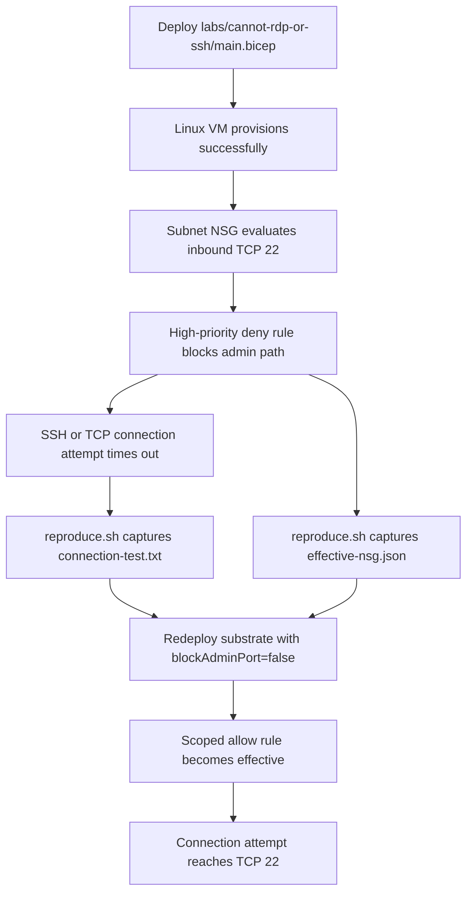

# Cannot RDP or SSH Lab

Use the `labs/cannot-rdp-or-ssh/` substrate to force a Linux VM into a deterministic admin-path connectivity failure where the VM provisions successfully but an NSG rule denies inbound SSH on TCP 22. The lab then captures connection and effective-NSG evidence before redeploying the same substrate with the deny path removed to prove the control was the network rule rather than the VM itself.

## Lab Metadata

| Attribute | Value |
|---|---|
| Difficulty | Intermediate |
| Estimated Duration | 20-30 minutes once a live Azure run is authorized |
| Platform | Azure Virtual Machines, Linux guest, public IP, subnet-level NSG |
| Failure Mode | VM provisions successfully but inbound SSH on TCP 22 times out because a high-priority NSG deny rule blocks the management path |
| Skills Practiced | Distinguishing network-path failure from guest failure, reading effective NSG rules, correlating client timeout evidence, falsifying with a scoped NSG redeploy |

## 1) Background

When an operator cannot RDP or SSH to an Azure VM, the symptom does not automatically prove the guest is unhealthy. A management-path failure can happen even when the VM booted normally, the OS is running, and the control plane reports the resource as healthy.

The substrate under `labs/cannot-rdp-or-ssh/` makes that separation explicit:

- `main.bicep` provisions a Linux VM with a public IP, NIC, VNet, subnet, and subnet-level NSG.
- The NSG contains a narrow allow rule for TCP 22 and a higher-priority deny rule that blocks the same port while `blockAdminPort` remains `true`.
- `scripts/reproduce.sh` captures a direct TCP 22 connection attempt into `connection-test.txt` and effective NSG output into `effective-nsg.json`.
- The initial authoring PR commits only honest placeholder evidence files. Live output is intentionally deferred.

<!-- diagram-id: cannot-rdp-or-ssh-lab-flow -->


This design isolates hypothesis **H1: NSG or route path blocks traffic** from the paired playbook's broader causes such as guest firewall, credentials, or VM agent health.

## 2) Hypothesis

**IF** the lab deploys the substrate exactly as authored in `labs/cannot-rdp-or-ssh/main.bicep`, **THEN** the VM should reach a healthy created state while inbound SSH on TCP 22 remains unreachable because the subnet NSG contains an explicit deny rule with higher priority than the allow rule.

Expected pre-fix behavior:

- The VM's provisioning state reports success even though the management connection fails.
- A direct TCP 22 connection test to the VM's public IP times out or reports that the port is filtered rather than returning an authentication prompt.
- `az network nic list-effective-nsg` shows an inbound deny rule for destination port `22` that wins before the scoped allow rule can help.
- The failure is falsifiable: redeploying the same template with `blockAdminPort=false` and a scoped `managementSourcePrefix` should remove the deny path and allow the same connection test to progress farther.

## 3) Runbook

### Deploy the failing substrate

```bash
export RG="rg-vm-adminpath-failure"
export LOCATION="koreacentral"
export VM_NAME="vmconlab-vm"
export SOURCE_CIDR="198.51.100.10/32"

az group create --name "$RG" --location "$LOCATION"

az deployment group create \
    --resource-group "$RG" \
    --template-file labs/cannot-rdp-or-ssh/main.bicep \
    --parameters @labs/cannot-rdp-or-ssh/parameters.json \
    --parameters location="$LOCATION" vmName="$VM_NAME" managementSourcePrefix="$SOURCE_CIDR"
```
| Command | Purpose |
| --- | --- |
| `az group create` | Create the resource group that scopes the lab substrate. |
| `--name` | Set the resource group name. |
| `--location` | Set the Azure region for the resource group. |
| `az deployment group create` | Deploy the Bicep template that creates the VM, networking resources, and intentional NSG block on TCP 22. |
| `--resource-group` | Target the resource group that receives the deployment. |
| `--template-file` | Point Azure CLI at `labs/cannot-rdp-or-ssh/main.bicep`. |
| `--parameters` | Supply the parameter file and override the location, VM name, and management source prefix used by the scoped allow rule. |

Expected result: the VM resource is created successfully, but inbound SSH remains unreachable because `blockAdminPort` stays `true` and the higher-priority deny rule blocks TCP 22.

### Reproduce and capture the failure

```bash
export RG="rg-vm-adminpath-failure"
export VM_NAME="vmconlab-vm"

bash labs/cannot-rdp-or-ssh/scripts/reproduce.sh
```
| Command | Purpose |
| --- | --- |
| `bash labs/cannot-rdp-or-ssh/scripts/reproduce.sh` | Capture the live TCP connection attempt and effective NSG payload into `labs/cannot-rdp-or-ssh/evidence/`. |

The script writes these real artifacts during a live run:

- `labs/cannot-rdp-or-ssh/evidence/connection-test.txt`
- `labs/cannot-rdp-or-ssh/evidence/effective-nsg.json`

### Apply the fix by redeploying a scoped allow path

```bash
az deployment group create \
    --resource-group "$RG" \
    --template-file labs/cannot-rdp-or-ssh/main.bicep \
    --parameters @labs/cannot-rdp-or-ssh/parameters.json \
    --parameters location="$LOCATION" vmName="$VM_NAME" managementSourcePrefix="$SOURCE_CIDR" blockAdminPort=false
```
| Command | Purpose |
| --- | --- |
| `az deployment group create` | Re-run the same Bicep template so the only meaningful behavioral change is the subnet NSG path. |
| `--resource-group` | Target the existing lab resource group. |
| `--template-file` | Reuse `labs/cannot-rdp-or-ssh/main.bicep` for a like-for-like redeploy. |
| `--parameters` | Reapply the original parameters while overriding `blockAdminPort=false` so the deny rule is removed and the scoped allow rule can take effect. |

This keeps the experiment falsifiable: the VM, image, NIC, subnet, and public IP stay the same, while the NSG behavior changes from deterministic deny to least-privilege allow.

### Re-run the capture after the fix

```bash
bash labs/cannot-rdp-or-ssh/scripts/reproduce.sh
```
| Command | Purpose |
| --- | --- |
| `bash labs/cannot-rdp-or-ssh/scripts/reproduce.sh` | Re-capture the connection test and effective NSG evidence after the scoped allow redeploy so the before/after comparison uses the same collection path. |

## 4) Experiment Log

This authoring PR documents the experiment structure only. No live Azure deployment was performed for this change.

### Substrate facts confirmed from repository source [Observed]

- `main.bicep` provisions a Linux VM, public IP, NIC, VNet, subnet, and subnet-level NSG.
- The NSG applies a higher-priority `deny-ssh` rule while `blockAdminPort` is `true`.
- `scripts/reproduce.sh` captures a direct TCP 22 reachability attempt and the NIC's effective NSG payload.
- `scripts/cleanup.sh` deletes the resource group with `az group delete --name "$RG" --yes --no-wait`.

### Pre-fix live evidence to confirm during the first real run [Not Proven]

- `connection-test.txt` should show that the client cannot complete a TCP 22 connection to the VM's public IP.
- `effective-nsg.json` should show the deny rule winning on inbound TCP 22.
- The VM itself should remain created and running, which weakens competing hypotheses about boot failure.

### Post-fix falsification target [Not Proven]

- After redeploying with `blockAdminPort=false`, the same effective NSG output should no longer show the intentional deny rule.
- The post-fix connection attempt should progress farther than the pre-fix timeout, ideally reaching the SSH banner or authentication prompt.
- If the connection still fails after removing the intentional deny rule, the original hypothesis is weakened and the operator should pivot back to the paired playbook's competing hypotheses: guest firewall, listener state, credentials, or guest health.

## 5) Verification Queries

This substrate does not provision Log Analytics, so the authoritative verification path for Variant A is Azure CLI plus a direct client connection attempt rather than KQL.

### Query the effective NSG rules before and after the fix

```bash
export NIC_NAME="vmconlab-nic"

az network nic list-effective-nsg \
    --resource-group "$RG" \
    --name "$NIC_NAME" \
    --output json
```
| Command | Purpose |
| --- | --- |
| `az network nic list-effective-nsg` | Read the effective security rules applied to the NIC so the winning inbound TCP 22 rule can be verified. |
| `--resource-group` | Scope the query to the lab resource group. |
| `--name` | Target the lab network interface. |
| `--output` | Return machine-readable JSON for evidence capture. |

Pass/fail rule:

- **Pre-fix pass**: the effective rules show the intentional inbound deny on destination port `22`.
- **Post-fix pass**: the intentional deny disappears, leaving only the scoped allow path for the operator source range.
- **Fail**: both runs show materially the same effective rule outcome, which means the NSG change did not falsify the original failure mode.

### Capture the client-side TCP 22 result

```bash
export PUBLIC_IP="$(az vm show --resource-group "$RG" --name "$VM_NAME" --show-details --query publicIps --output tsv)"

nc -vz -w 5 "$PUBLIC_IP" 22
```
| Command | Purpose |
| --- | --- |
| `az vm show` | Read the VM's assigned public IP so the client-side test hits the correct target. |
| `--resource-group` | Scope the query to the lab resource group. |
| `--name` | Target the lab virtual machine. |
| `--show-details` | Include the resolved public IP value in the CLI response. |
| `--query` | Return only the public IP field. |
| `--output` | Emit a plain TSV value suitable for the shell variable. |

Falsification after fix:

- The pre-fix run should time out or report that TCP 22 is filtered.
- The post-fix run should progress farther than the pre-fix result because the management path is no longer intentionally denied.
- Exact timings, exit codes, and terminal text are intentionally pending a real lab run and must not be pre-filled in this authoring-only change.

## 6) Portal Evidence

!!! note "Pending live capture"
    Portal screenshots are intentionally deferred for this authoring-only PR. Do not add image references until the screenshots exist on disk and have been visually verified for caption accuracy and PII safety.

When the first live run happens, capture the evidence into `docs/assets/troubleshooting/cannot-rdp-or-ssh/` and then add the markdown references in a follow-up change.

Recommended capture set:

1. **VM overview or instance view — VM healthy while access fails**
    - Purpose: show that the VM is provisioned and running even though the admin path is blocked.
    - Look for: successful VM state, correct VM name, and no indication of a boot failure.
2. **NIC or NSG effective security rules — pre-fix deny**
    - Purpose: show the explicit rule that blocks inbound TCP 22.
    - Look for: deny rule name, inbound direction, TCP 22 destination port, and higher priority than the allow rule.
3. **Networking blade — inbound rule set after the fix**
    - Purpose: show that the intentional deny rule is gone and the scoped allow rule remains.
    - Look for: allow rule source prefix and absence of the intentional deny rule.
4. **Client or Bastion follow-up evidence — post-fix reachability**
    - Purpose: falsify the original hypothesis by showing the management path now reaches the VM.
    - Look for: evidence that the connection gets past the previous timeout state.

[Not Proven] No screenshot files exist yet in this repository for this lab, so the Portal evidence remains a capture plan rather than completed evidence.

## Clean Up

```bash
export RG="rg-vm-adminpath-failure"

bash labs/cannot-rdp-or-ssh/scripts/cleanup.sh
```
| Command | Purpose |
| --- | --- |
| `bash labs/cannot-rdp-or-ssh/scripts/cleanup.sh` | Run the substrate teardown helper, which calls `az group delete --name "$RG" --yes --no-wait`. |

If you need to delete the group directly instead of using the helper, run `az group delete --name "$RG" --yes --no-wait` from the repository root.

## Related Playbook

- [Cannot RDP or SSH](../playbooks/connectivity/cannot-rdp-or-ssh.md)

Use the playbook when the lab's controlled NSG deny is **not** enough to explain the live symptom. The playbook broadens the investigation to guest firewall, listener state, credentials, Bastion, and VM agent health.

## See Also

- [Lab Guides](index.md)
- [Troubleshooting](../index.md)
- [Connectivity Checklist](../first-10-minutes/connectivity.md)
- [Cannot RDP or SSH playbook](../playbooks/connectivity/cannot-rdp-or-ssh.md)

## Sources

- [Quickstart: Create a Linux virtual machine by using Bicep](https://learn.microsoft.com/en-us/azure/virtual-machines/linux/quick-create-bicep)
- [Network security groups overview](https://learn.microsoft.com/en-us/azure/virtual-network/network-security-groups-overview)
- [Troubleshoot SSH connections to an Azure Linux VM](https://learn.microsoft.com/en-us/troubleshoot/azure/virtual-machines/troubleshoot-ssh-connection)
